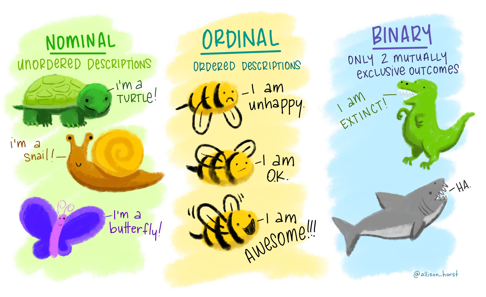
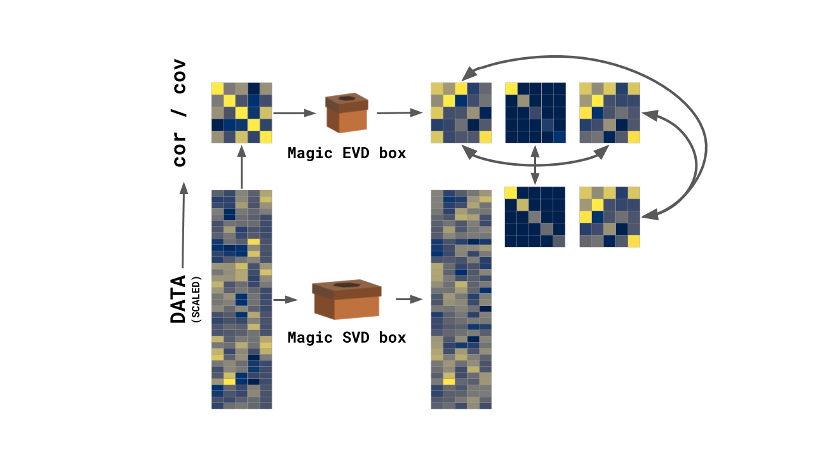
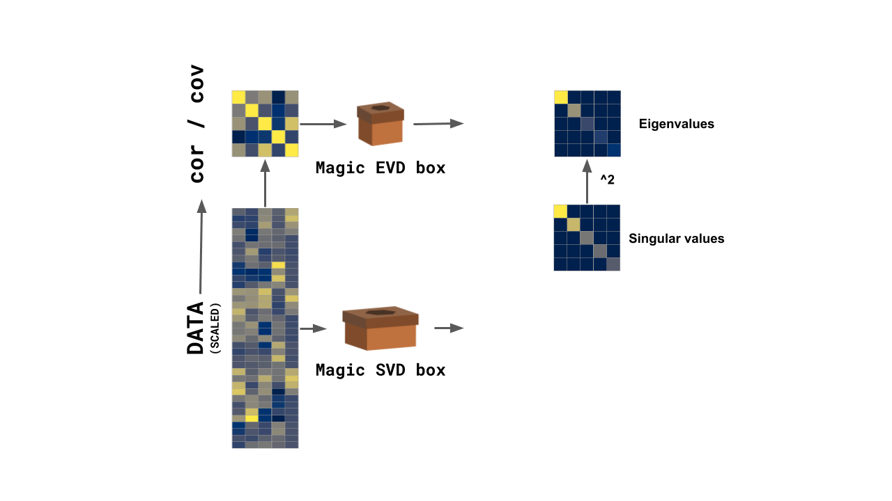
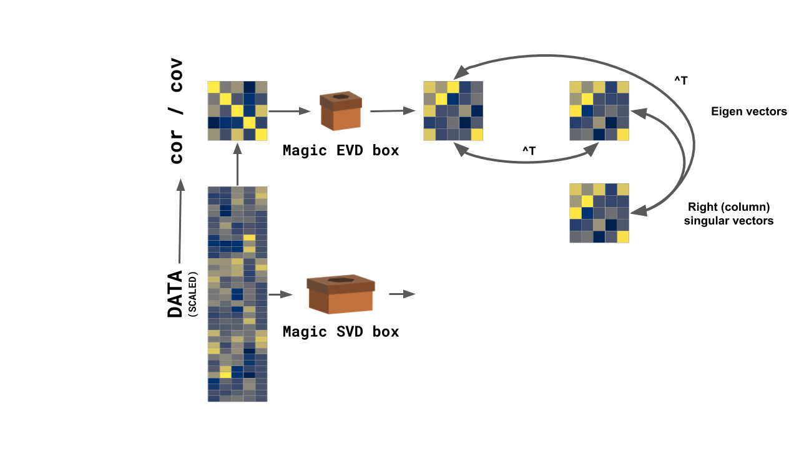
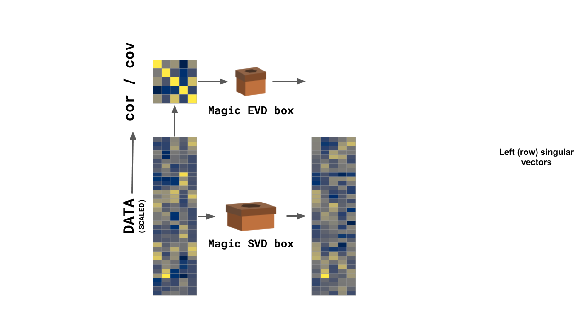
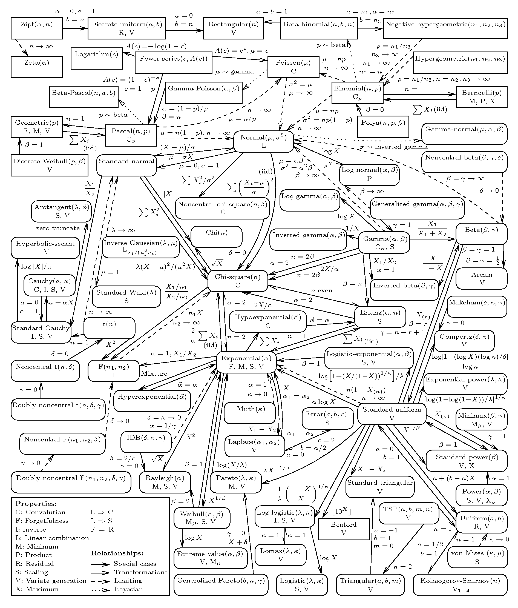
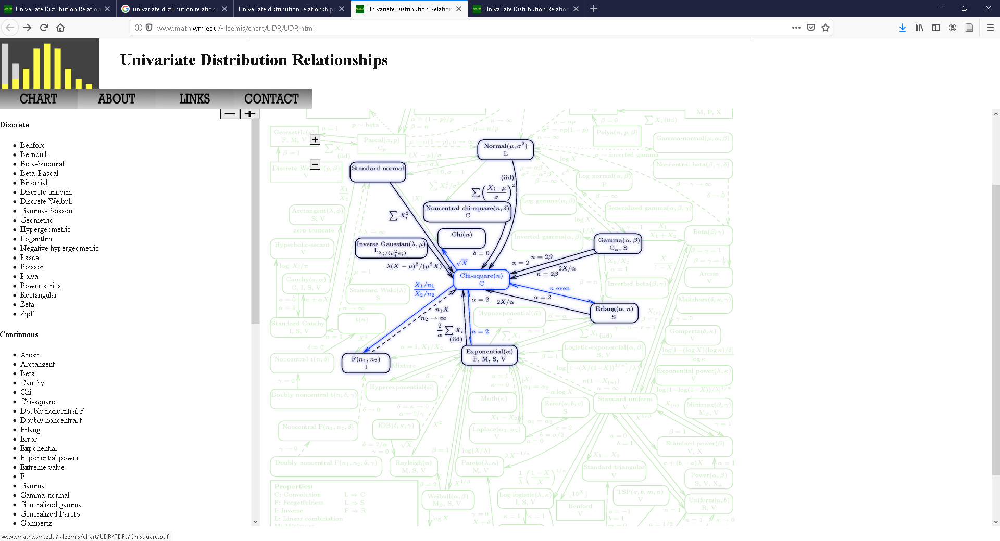

```{r setup, include=FALSE}
library(knitr)
knitr::opts_chunk$set(echo = FALSE)
library(tidyverse)
library(ggplot2)
library(ExPosition)
library(ours)
library(factoextra)
library(gridExtra)
library(grid)
library(ggcorrplot)
library(ggrepel)
library(kableExtra)
library(plyr)


load(file=paste0(Sys.getenv("ADNI_FOLDER"),"\\","amerge_subset.rda"))
load(file=paste0(Sys.getenv("ADNI_FOLDER"),"\\","variable_type_map.rda"))


## re-code amerge_subset$PTEDUCAT

amerge_subset$PTEDUCAT <- mapvalues(amerge_subset$PTEDUCAT,from = "12","HS")
amerge_subset$PTEDUCAT <- mapvalues(amerge_subset$PTEDUCAT,from = c(13,14,15),c("HS+","HS+","HS+"))
amerge_subset$PTEDUCAT <- mapvalues(amerge_subset$PTEDUCAT,from = c(16),c("B"))
amerge_subset$PTEDUCAT <- mapvalues(amerge_subset$PTEDUCAT,from = c(17,18,19),c("B+","B+","B+"))
amerge_subset$PTEDUCAT <- mapvalues(amerge_subset$PTEDUCAT,from = c(20),c("ADV"))


```

# Before we get started 

### Our new best friends

{width=75%, height=75%}

[via \@allison_horst](https://twitter.com/allison_horst)

***

{width=75%, height=75%}

[via \@allison_horst](https://twitter.com/allison_horst)

***

{width=40%, height=40%}{width=40%, height=40%}

[via \@allison_horst](https://twitter.com/allison_horst)


### Motivation for today

* Not everything is a number
* Sometimes numbers aren't numbers!
* We need to recognize when this happens
  + And know what to do

### Typology

* SS Stevens (not a boat!)
* Levels of measurement
* Excellent examples: https://en.wikipedia.org/wiki/Level_of_measurement


### Where to find everything

* Generally: https://github.com/derekbeaton/workshops
* Today: 

### Overview

* Revisit PCA
* Looking at some data
* Simple correspondence analysis
  + and many of its connections
* Multiple correspondence analysis
  + generalizes CA (amongst many other things)
  + and how to handle various data types
* A whole bunch of bonuses
  + Robustness
  + PLS
  + Networks
  + Software

# Revisting PCA

### What is PCA for?

* When we can compute a covariance or correlation matrix
* Break data into components
  + Orthogonal
  + Rank ordered
  + Made of bits & pieces of original measures
  

### Eigen- and singular value decompositions


### Eigen- and singular value decompositions



### Eigen- and singular value decompositions



### Eigen- and singular value decompositions



### Eigen- and singular value decompositions



# Some data

### Diagnosis and education

```{r edu_dx, fig.height=8, fig.width=3.2, fig.align='center'}

edu_dx_table <- table(amerge_subset$PTEDUCAT, amerge_subset$DX)
# edt_grob <- tableGrob(edu_dx_table)
# grid.arrange(edt_grob)

kable(edu_dx_table, "latex", booktabs = T) %>%
  kable_styling() %>%
  column_spec(column = 1, italic = T)

```

***

* Given a table, and asked for a multivariate analysis
* We do what we know: PCA


***

```{r edu_dx_pca_1}

edu_dx_pca <- epPCA(edu_dx_table, graphs=F)


pca_rows <- fviz_pca_ind(edu_dx_pca, repel = T) +
  coord_cartesian(xlim=c(edu_dx_pca$Plotting.Data$constraints$minx, edu_dx_pca$Plotting.Data$constraints$maxx), ylim = c(edu_dx_pca$Plotting.Data$constraints$miny, edu_dx_pca$Plotting.Data$constraints$maxy)) +
  theme(panel.grid.major = element_blank(), panel.grid.minor = element_blank(),
        axis.text.x=element_blank(),
        axis.ticks.x=element_blank(),
        axis.text.y=element_blank(),
        axis.ticks.y=element_blank()) +
  xlab(paste0("Component 1. Explained variance: ", round(edu_dx_pca$ExPosition.Data$t[1], digits=2),"%")) +
  ylab(paste0("Component 2. Explained variance: ", round(edu_dx_pca$ExPosition.Data$t[2], digits=2),"%")) +
  ggtitle("PCA:\nRow component scores")


pca_vars <- fviz_pca_var(edu_dx_pca) +
  xlab(paste0("Component 1. Explained variance: ", round(edu_dx_pca$ExPosition.Data$t[1], digits=2),"%")) +
  ylab(paste0("Component 2. Explained variance: ", round(edu_dx_pca$ExPosition.Data$t[2], digits=2),"%")) +
  ggtitle("PCA:\nVariable-Component Correlations")

grid.arrange(pca_rows, pca_vars, nrow=1)

```

### What did we analyze?

```{r edu_dx_cor1, fig.align='center'}

kable(round(cor(edu_dx_table), digits=3), "latex", booktabs = T) %>%
  kable_styling()

```

### What did PCA detect?

```{edu_dx_rowsums, fig.align='center'}

edu_dx_with_sums <- cbind(edu_dx_table, rowSums(edu_dx_table))
colnames(edu_dx_with_sums)[ncol(edu_dx_with_sums)] <- "Row sums"

kable(edu_dx_with_sums, "latex", booktabs = T) %>%
  kable_styling() %>%
  column_spec(column = 1, italic = T) %>%
  column_spec(column = ncol(edu_dx_with_sums)+1, bold = T)

```

### Let's try something different!

```{r edu_dx_different, fig.height=8, fig.width=3.2, fig.align='center'}

edu_dx_table <- t(edu_dx_table)

kable(edu_dx_table, "latex", booktabs = T) %>%
  kable_styling() %>%
  column_spec(column = 1, italic = T)

```

***

```{r edu_dx_pca_2}

edu_dx_pca <- epPCA(edu_dx_table, graphs=F)


pca_rows <- fviz_pca_ind(edu_dx_pca, repel = T) +
  coord_cartesian(xlim=c(edu_dx_pca$Plotting.Data$constraints$minx, edu_dx_pca$Plotting.Data$constraints$maxx), ylim = c(edu_dx_pca$Plotting.Data$constraints$miny, edu_dx_pca$Plotting.Data$constraints$maxy)) +
  theme(panel.grid.major = element_blank(), panel.grid.minor = element_blank(),
        axis.text.x=element_blank(),
        axis.ticks.x=element_blank(),
        axis.text.y=element_blank(),
        axis.ticks.y=element_blank()) +
  xlab(paste0("Component 1. Explained variance: ", round(edu_dx_pca$ExPosition.Data$t[1], digits=2),"%")) +
  ylab(paste0("Component 2. Explained variance: ", round(edu_dx_pca$ExPosition.Data$t[2], digits=2),"%")) +
  ggtitle("PCA:\nRow component scores")


pca_vars <- fviz_pca_var(edu_dx_pca) +
  xlab(paste0("Component 1. Explained variance: ", round(edu_dx_pca$ExPosition.Data$t[1], digits=2),"%")) +
  ylab(paste0("Component 2. Explained variance: ", round(edu_dx_pca$ExPosition.Data$t[2], digits=2),"%")) +
  ggtitle("PCA:\nVariable-Component Correlations")

grid.arrange(pca_rows, pca_vars, nrow=1)

```

### What did PCA analyze?

```{r edu_dx_cor2, fig.height=8, fig.width=3.2, fig.align='center'}


kable(round(cor(edu_dx_table), digits=3), "latex", booktabs = T) %>%
  kable_styling()

```

### What did PCA detect?

```{r edu_dx_colsums, fig.height=8, fig.width=3.2, fig.align='center'}
edu_dx_with_sums <- cbind(edu_dx_table, rowSums(edu_dx_table))
colnames(edu_dx_with_sums)[ncol(edu_dx_with_sums)] <- "Row sums"


kable(edu_dx_with_sums, "latex", booktabs = T) %>%
  kable_styling() %>%
  column_spec(column = 1, italic = T) %>%
  column_spec(column = ncol(edu_dx_with_sums)+1, bold = T)

```

### What is PCA for?

* When we can compute a *meaningful* covariance or correlation matrix

### Let's take another look

```{r edu_dx_anotherlook, fig.height=8, fig.width=3.2, fig.align='center'}

edu_dx_table <- table(amerge_subset$PTEDUCAT, amerge_subset$DX)
edu_dx_with_sums <- rbind(cbind(edu_dx_table, rowSums(edu_dx_table)), colSums(edu_dx_table))

edu_dx_with_sums[nrow(edu_dx_with_sums), ncol(edu_dx_with_sums)] <- ""
colnames(edu_dx_with_sums)[ncol(edu_dx_with_sums)] <- "Row sums"
rownames(edu_dx_with_sums)[nrow(edu_dx_with_sums)] <- "Column sums"

kable(edu_dx_with_sums, "latex", booktabs = T) %>%
  kable_styling() %>%
  column_spec(column = 1, italic = T) %>%
  column_spec(column = ncol(edu_dx_with_sums)+1, bold = T) %>%
  row_spec(row = nrow(edu_dx_with_sums)+1, bold = T)

```


# Simple correspondence analysis

### History

* CA
  + Hirschfeld (1935)
  + Guttman (1941)
  + Burt (1950)
  + Benzecri (1964)
  + Escofier (1965)
* See Lebart's History & Prehistory of CA: http://www.dtmvic.com/doc/About_the_History_of_CA.pdf

### Chi-squared



[See here](http://www.math.wm.edu/~leemis/chart/UDR/UDR.html)

### Chi-squared



[See here](http://www.math.wm.edu/~leemis/chart/UDR/UDR.html)

### Under the hood

* The eigenvalue decomposition (EVD)
  + Requires squares, symmetric, and positive semi definite
  + Generally correlation or covariance
* The singular value decomposition (SVD)
  + Works with rectangular tables
* The generalized SVD
  + Apply constraints (weights) to rows & columns of rectangular table
  + Required for CA and fancier PCA-like techniques & extensions

### The GSVD


# Multiple correspondence analysis


# Some many bonuses!

## Software

* ExPosition
  + Family of packages
  + Includes resampling
  + Lots of PCA & CA techniques
* factoextra
  + Awesome ggplot2 visualizers for ExPosition
  + http://www.alboukadel.com/ & http://www.sthda.com/english/
* ours
  + Developed here within ONDRI
  + New package for outliers
  + Has some important bells-and-whistles

## Some alternatives

* FactoMineR
* ade4
* ca
* MASS
* psych
* So many others


# (Some) References

### See the reference sections of these

* Beaton, D., Saporta, G., Abdi, H., & Alzheimer's Disease Neuroimaging Initiative. (2019). A generalization of partial least squares regression and correspondence analysis for categorical and mixed data: An application with the ADNI data. bioRxiv, 598888.

* Beaton, D., Sunderland, K. M., Levine, B., Mandzia, J., Masellis, M., Swartz, R. H., ... & Strother, S. C. (2019). Generalization of the minimum covariance determinant algorithm for categorical and mixed data types. bioRxiv, 333005.

### And these

* Abdi, H., Guillemot, V., Eslami, A., & Beaton, D. (2017). Canonical correlation analysis. Encyclopedia of Social Network Analysis and Mining, 1-16.

* Beaton, D., Dunlop, J., & Abdi, H. (2016). Partial least squares correspondence analysis: A framework to simultaneously analyze behavioral and genetic data. Psychological methods, 21(4), 621.

### Techniques

* Greenacre, M. (2017). Correspondence analysis in practice. CRC press.

* Greenacre, M. J. (1984). Theory and Applications of Correspondence Analysis. Retrieved from http://books.google.com/books?id=LsPaAAAAMAAJ

### Techniques

* Greenacre, M. J. (2010). Correspondence analysis. Wiley Interdisciplinary Reviews: Computational Statistics, 2(5), 613–619. https://doi.org/10.1002/wics.114

* Lebart, L., Morineau, A., & Warwick, K. M. (1984). Multivariate descriptive statistical analysis: correspondence analysis and related techniques for large matrices. Wiley.

* Nguyen, L. H., & Holmes, S. (2019). Ten quick tips for effective dimensionality reduction. PLOS Computational Biology, 15(6), e1006907.


### Data

* Escofier, B. (1978). Analyse factorielle et distances répondant au principe d’équivalence distributionnelle. Revue de Statistique Appliquée, 26(4), 29–37.

* Escofier, B. (1979). Traitement simultané de variables qualitatives et quantitatives en analyse factorielle. Cahiers de l’Analyse Des Données, 4(2), 137–146.

* Greenacre, M. (2014). Data Doubling and Fuzzy Coding. In J. Blasius & M. Greenacre (Eds.), Visualization and Verbalization of Data (pp. 239–253). Philadelphia, PA, USA: CRC Press.

