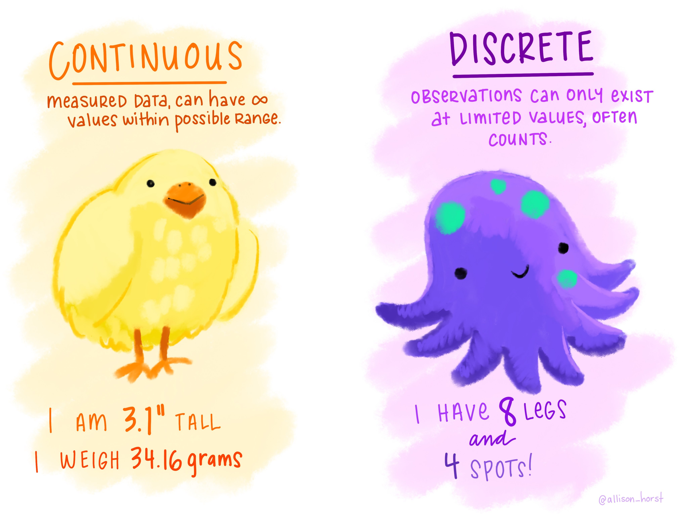
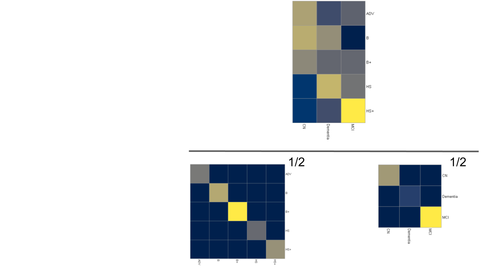

```{r setup, include=FALSE}
library(knitr)
knitr::opts_chunk$set(echo = FALSE)
library(tidyverse)
library(ggplot2)
library(ExPosition)
library(ours)
library(factoextra)
library(gridExtra)
library(grid)
library(ggcorrplot)
library(ggrepel)
library(kableExtra)
library(plyr)
library(GPLS)

load(file=paste0(Sys.getenv("ADNI_FOLDER"),"\\","amerge_subset.rda"))
load(file=paste0(Sys.getenv("ADNI_FOLDER"),"\\","variable_type_map.rda"))


## re-code amerge_subset$PTEDUCAT

amerge_subset$PTEDUCAT <- mapvalues(amerge_subset$PTEDUCAT,from = "12","HS")
amerge_subset$PTEDUCAT <- mapvalues(amerge_subset$PTEDUCAT,from = c(13,14,15),c("HS+","HS+","HS+"))
amerge_subset$PTEDUCAT <- mapvalues(amerge_subset$PTEDUCAT,from = c(16),c("B"))
amerge_subset$PTEDUCAT <- mapvalues(amerge_subset$PTEDUCAT,from = c(17,18,19),c("B+","B+","B+"))
amerge_subset$PTEDUCAT <- mapvalues(amerge_subset$PTEDUCAT,from = c(20),c("ADV"))


find_cell <- function(table, row, col, name="core-fg"){
  l <- table$layout
  which(l$t==row & l$l==col & l$name==name)
}

```

# Before we get started 

### Our new best friends

{width=75%, height=75%}

[via \@allison_horst](https://twitter.com/allison_horst)

***

{width=75%, height=75%}

[via \@allison_horst](https://twitter.com/allison_horst)

***

{width=40%, height=40%}{width=40%, height=40%}

* What do we do with all of these in a PCA like way?
* Some are *very* difficult and effectively ignored
  + We won't do that!
* See SS Steven's typology: https://en.wikipedia.org/wiki/Level_of_measurement

### Motivation & Objectives

* Not everything is a number
  + Sometimes numbers aren't numbers!
* We need to recognize when this happens
  + And know what to do
* Introduce CA, MCA, and tricks
  + Leave you overwhelmed, but knowing that
  + PCA is sometimes the most wrong approach
  + CA & MCA are suitably less wrong

### Where to find everything

* Generally: https://github.com/derekbeaton/workshops
* Today: https://github.com/derekbeaton/Workshops/tree/master/Misc/CA_MCA

### Overview

* Revisit PCA
* Looking at some data
* Simple correspondence analysis
  + and many of its connections
* Multiple correspondence analysis
  + generalizes CA (amongst many other things)
  + and how to handle various data types
* A whole bunch of bonuses
  + Robustness, PLS, Networks, Software

# Revisting PCA

### What is PCA for?

* When we can compute a covariance or correlation matrix
* Break data into components
  + Orthogonal
  + Rank ordered
  + Made of bits & pieces of original measures
  

### Eigen- and singular value decompositions


### Eigen- and singular value decompositions


### Eigen- and singular value decompositions


### Eigen- and singular value decompositions


### Eigen- and singular value decompositions


# Some data

### Diagnosis and education

```{r edu_dx}

edu_dx_table <- table(amerge_subset$PTEDUCAT, amerge_subset$DX)

kable(edu_dx_table, "latex", booktabs = T) %>%
  kable_styling() %>%
  column_spec(column = 1, italic = T)

```

***

* Given a table, and asked for a multivariate analysis
* We do what we know: PCA


***

```{r edu_dx_pca_1}

edu_dx_pca <- epPCA(edu_dx_table, graphs=F)


pca_rows <- fviz_pca_ind(edu_dx_pca, repel = T) +
  coord_cartesian(xlim=c(edu_dx_pca$Plotting.Data$constraints$minx, edu_dx_pca$Plotting.Data$constraints$maxx), ylim = c(edu_dx_pca$Plotting.Data$constraints$miny, edu_dx_pca$Plotting.Data$constraints$maxy)) +
  theme(panel.grid.major = element_blank(), panel.grid.minor = element_blank(),
        axis.text.x=element_blank(),
        axis.ticks.x=element_blank(),
        axis.text.y=element_blank(),
        axis.ticks.y=element_blank()) +
  xlab(paste0("Component 1. Explained variance: ", round(edu_dx_pca$ExPosition.Data$t[1], digits=2),"%")) +
  ylab(paste0("Component 2. Explained variance: ", round(edu_dx_pca$ExPosition.Data$t[2], digits=2),"%")) +
  ggtitle("PCA:\nRow component scores")


pca_vars <- fviz_pca_var(edu_dx_pca) +
  xlab(paste0("Component 1. Explained variance: ", round(edu_dx_pca$ExPosition.Data$t[1], digits=2),"%")) +
  ylab(paste0("Component 2. Explained variance: ", round(edu_dx_pca$ExPosition.Data$t[2], digits=2),"%")) +
  ggtitle("PCA:\nVariable-Component Correlations")

```

***

```{r}
grid.arrange(pca_rows, textGrob(""), nrow=1)
```

***

```{r}
grid.arrange(textGrob(""), pca_vars, nrow=1)
```

***

```{r}
grid.arrange(pca_rows, pca_vars, nrow=1)
```


### What did we analyze?

```{r edu_dx_cor1}

kable(round(cor(edu_dx_table), digits=3), "latex", booktabs = T) %>%
  kable_styling()

```

### What did PCA detect?

```{r edu_dx_rowsums}

edu_dx_with_sums <- cbind(edu_dx_table, rowSums(edu_dx_table))
colnames(edu_dx_with_sums)[ncol(edu_dx_with_sums)] <- "Row sums"

kable(edu_dx_with_sums, "latex", booktabs = T) %>%
  kable_styling() %>%
  column_spec(column = 1, italic = T) %>%
  column_spec(column = ncol(edu_dx_with_sums)+1, bold = T, italic = T)

```

### Let's try something different!

```{r edu_dx_different}

edu_dx_table <- t(edu_dx_table)

kable(edu_dx_table, "latex", booktabs = T) %>%
  kable_styling() %>%
  column_spec(column = 1, italic = T)

```

***

```{r edu_dx_pca_2}

edu_dx_pca <- epPCA(edu_dx_table, graphs=F)


pca_rows <- fviz_pca_ind(edu_dx_pca, repel = T) +
  coord_cartesian(xlim=c(edu_dx_pca$Plotting.Data$constraints$minx, edu_dx_pca$Plotting.Data$constraints$maxx), ylim = c(edu_dx_pca$Plotting.Data$constraints$miny, edu_dx_pca$Plotting.Data$constraints$maxy)) +
  theme(panel.grid.major = element_blank(), panel.grid.minor = element_blank(),
        axis.text.x=element_blank(),
        axis.ticks.x=element_blank(),
        axis.text.y=element_blank(),
        axis.ticks.y=element_blank()) +
  xlab(paste0("Component 1. Explained variance: ", round(edu_dx_pca$ExPosition.Data$t[1], digits=2),"%")) +
  ylab(paste0("Component 2. Explained variance: ", round(edu_dx_pca$ExPosition.Data$t[2], digits=2),"%")) +
  ggtitle("PCA:\nRow component scores")


pca_vars <- fviz_pca_var(edu_dx_pca) +
  xlab(paste0("Component 1. Explained variance: ", round(edu_dx_pca$ExPosition.Data$t[1], digits=2),"%")) +
  ylab(paste0("Component 2. Explained variance: ", round(edu_dx_pca$ExPosition.Data$t[2], digits=2),"%")) +
  ggtitle("PCA:\nVariable-Component Correlations")

grid.arrange(pca_rows, pca_vars, nrow=1)

```

### What did PCA analyze?

```{r edu_dx_cor2}


kable(round(cor(edu_dx_table), digits=3), "latex", booktabs = T) %>%
  kable_styling()

```

### What did PCA detect?

```{r edu_dx_colsums}
edu_dx_with_sums <- cbind(edu_dx_table, rowSums(edu_dx_table))
colnames(edu_dx_with_sums)[ncol(edu_dx_with_sums)] <- "Row sums"


kable(edu_dx_with_sums, "latex", booktabs = T) %>%
  kable_styling() %>%
  column_spec(column = 1, italic = T) %>%
  column_spec(column = ncol(edu_dx_with_sums)+1, bold = T, italic = T)

```

### What is PCA for?

* When we can compute a *meaningful* covariance or correlation matrix

### Let's take another look

```{r edu_dx_anotherlook, warning=FALSE}

edu_dx_table <- table(amerge_subset$PTEDUCAT, amerge_subset$DX)
edu_dx_with_sums <- rbind(cbind(edu_dx_table, rowSums(edu_dx_table)), colSums(edu_dx_table))

edu_dx_with_sums[nrow(edu_dx_with_sums), ncol(edu_dx_with_sums)] <- NA
colnames(edu_dx_with_sums)[ncol(edu_dx_with_sums)] <- "Row sums"
rownames(edu_dx_with_sums)[nrow(edu_dx_with_sums)] <- "Column sums"

options(knitr.kable.NA = '')
kable(edu_dx_with_sums, "latex", booktabs = T) %>%
  kable_styling() %>%
  column_spec(column = 1, italic = T) %>%
  column_spec(column = ncol(edu_dx_with_sums)+1, bold = T, italic = T) %>%
  row_spec(row = nrow(edu_dx_with_sums), bold = T, italic = T)

```

* Tell me things about this matrix
* What kind of problem does this look like?


# Simple correspondence analysis


### What is CA?

* Initially: *visualize contingency tables* (**a la PCA**, factor analyses)
  + Text (corpus) of philosphy, biblical passages, literature
  + From Benzecri (1964) & Escofier (1965)
  + Fully developed by Escofier (1969)
* Explosion of the technique in France
  + Across virtually every field (except psychology and neuroscience)

### History

* Hotelling (1933) & Thurstone (1933) 
* Hirschfeld (1935) & Horst (1935)
* Guttman (1941)
* Burt (1950)
* And then Benzecri (1964) & Escofier (1965)
* Many more very important characters to re-discover CA

***

* See Lebart's History & Prehistory of CA 
  + http://www.dtmvic.com/doc/About_the_History_of_CA.pdf
* And Beh & Lombardo's series
  + A geneaology of CA: https://onlinelibrary.wiley.com/doi/abs/10.1111/j.1467-842X.2012.00676.x
  + A geneaology of CA 2: http://siba-ese.unisalento.it/index.php/ejasa/article/view/19785


### We're diving in

```{r edu_dx_again}

edu_dx_table <- table(amerge_subset$PTEDUCAT, amerge_subset$DX)

kable(edu_dx_table, "latex", booktabs = T) %>%
  kable_styling() %>%
  column_spec(column = 1, italic = T)

```

```{r ca_results}

edu_dx_ca <- epCA(edu_dx_table, graphs = F)


ca_rows <- fviz_ca_row(edu_dx_ca) +
  coord_cartesian(xlim=c(edu_dx_ca$Plotting.Data$constraints$minx, edu_dx_ca$Plotting.Data$constraints$maxx), ylim = c(edu_dx_ca$Plotting.Data$constraints$miny, edu_dx_ca$Plotting.Data$constraints$maxy)) +
  theme(panel.grid.major = element_blank(), panel.grid.minor = element_blank(),
        axis.text.x=element_blank(),
        axis.ticks.x=element_blank(),
        axis.text.y=element_blank(),
        axis.ticks.y=element_blank()) +
  xlab(paste0("Component 1. Explained variance: ", round(edu_dx_ca$ExPosition.Data$t[1], digits=2),"%")) +
  ylab(paste0("Component 2. Explained variance: ", round(edu_dx_ca$ExPosition.Data$t[2], digits=2),"%")) +
  ggtitle("CA:\nRow component scores")


ca_cols <- fviz_ca_col(edu_dx_ca) +
  coord_cartesian(xlim=c(edu_dx_ca$Plotting.Data$constraints$minx, edu_dx_ca$Plotting.Data$constraints$maxx), ylim = c(edu_dx_ca$Plotting.Data$constraints$miny, edu_dx_ca$Plotting.Data$constraints$maxy)) +
  theme(panel.grid.major = element_blank(), panel.grid.minor = element_blank(),
        axis.text.x=element_blank(),
        axis.ticks.x=element_blank(),
        axis.text.y=element_blank(),
        axis.ticks.y=element_blank()) +
  xlab(paste0("Component 1. Explained variance: ", round(edu_dx_ca$ExPosition.Data$t[1], digits=2),"%")) +
  ylab(paste0("Component 2. Explained variance: ", round(edu_dx_ca$ExPosition.Data$t[2], digits=2),"%")) +
  ggtitle("CA:\nColumn component scores")

```

*** 

```{r show_ca_rows_1}

grid.arrange(ca_rows, textGrob(""), nrow=1)

```

*** 

```{r show_ca_cols_1}

grid.arrange(textGrob(""), ca_cols, nrow=1)

```

*** 

```{r show_ca_both_1}

grid.arrange(ca_rows, ca_cols, nrow=1)

```

*** 

Want to see a cool trick?

*** 

```{r edu_dx_againagain}

edu_dx_table <- table(amerge_subset$PTEDUCAT, amerge_subset$DX)

kable(edu_dx_table, "latex", booktabs = T) %>%
  kable_styling() %>%
  column_spec(column = 1, italic = T)

```

*** 

```{r edu_dx_transpose}

edu_dx_table <- t(edu_dx_table)

kable(edu_dx_table, "latex", booktabs = T) %>%
  kable_styling() %>%
  column_spec(column = 1, italic = T)

```
What if we perform CA on this?

***

```{r ca_results_transponse}

edu_dx_ca <- epCA(edu_dx_table, graphs = F)


ca_rows <- fviz_ca_row(edu_dx_ca) +
  coord_cartesian(xlim=c(edu_dx_ca$Plotting.Data$constraints$minx, edu_dx_ca$Plotting.Data$constraints$maxx), ylim = c(edu_dx_ca$Plotting.Data$constraints$miny, edu_dx_ca$Plotting.Data$constraints$maxy)) +
  theme(panel.grid.major = element_blank(), panel.grid.minor = element_blank(),
        axis.text.x=element_blank(),
        axis.ticks.x=element_blank(),
        axis.text.y=element_blank(),
        axis.ticks.y=element_blank()) +
  xlab(paste0("Component 1. Explained variance: ", round(edu_dx_ca$ExPosition.Data$t[1], digits=2),"%")) +
  ylab(paste0("Component 2. Explained variance: ", round(edu_dx_ca$ExPosition.Data$t[2], digits=2),"%")) +
  ggtitle("CA:\nRow component scores")


ca_cols <- fviz_ca_col(edu_dx_ca) +
  coord_cartesian(xlim=c(edu_dx_ca$Plotting.Data$constraints$minx, edu_dx_ca$Plotting.Data$constraints$maxx), ylim = c(edu_dx_ca$Plotting.Data$constraints$miny, edu_dx_ca$Plotting.Data$constraints$maxy)) +
  theme(panel.grid.major = element_blank(), panel.grid.minor = element_blank(),
        axis.text.x=element_blank(),
        axis.ticks.x=element_blank(),
        axis.text.y=element_blank(),
        axis.ticks.y=element_blank()) +
  xlab(paste0("Component 1. Explained variance: ", round(edu_dx_ca$ExPosition.Data$t[1], digits=2),"%")) +
  ylab(paste0("Component 2. Explained variance: ", round(edu_dx_ca$ExPosition.Data$t[2], digits=2),"%")) +
  ggtitle("CA:\nColumn component scores")


grid.arrange(ca_rows, ca_cols, nrow=1)

```
<!--
### Bells, whistles

* Singular vectors, singular values, eigenvalues
* Component scores
* Generalized (weighted) singular vectors
-->

### How did that happen?


```{r edu_dx_chi2}

edu_dx_table <- table(amerge_subset$PTEDUCAT, amerge_subset$DX)

kable(edu_dx_table, "latex", booktabs = T, caption = "Data") %>%
  kable_styling() %>%
  column_spec(column = 1, italic = T)

```

***

```{r edu_dx_chi2_o}

kable( round(edu_dx_table / sum(edu_dx_table), digits= 3), "latex", booktabs = T, caption = "Observed probabilites") %>%
  kable_styling() %>%
  column_spec(column = 1, italic = T)

```

***

```{r edu_dx_chi2_osums, warning = FALSE}


observed_probs <- edu_dx_table / sum(edu_dx_table)

edu_dx_with_sums <- rbind(cbind(observed_probs, rowSums(observed_probs)), colSums(observed_probs))
edu_dx_with_sums <- round(edu_dx_with_sums, digits = 3)
colnames(edu_dx_with_sums)[ncol(edu_dx_with_sums)] <- "Row sums"
rownames(edu_dx_with_sums)[nrow(edu_dx_with_sums)] <- "Column sums"
edu_dx_with_sums[nrow(edu_dx_with_sums), ncol(edu_dx_with_sums)] <- NA

options(knitr.kable.NA = '')
kable( edu_dx_with_sums, "latex", booktabs = T, caption = "Observed probabilites and margins") %>%
  kable_styling() %>%
  column_spec(column = 1, italic = T) %>%
  column_spec(column = ncol(edu_dx_with_sums)+1, bold = T, italic = T) %>%
  row_spec(row = nrow(edu_dx_with_sums), bold = T, italic = T)

```

***

```{r edu_dx_chi2_e, warning = FALSE}


row_probs <- rowSums(observed_probs)
col_probs <- colSums(observed_probs)
expected_probabilities <- row_probs %o% col_probs

expected_probabilities_with_sums <- round(rbind(cbind(expected_probabilities, row_probs), col_probs), digits = 3)

colnames(expected_probabilities_with_sums)[ncol(expected_probabilities_with_sums)] <- "Row sums"
rownames(expected_probabilities_with_sums)[nrow(expected_probabilities_with_sums)] <- "Column sums"
expected_probabilities_with_sums[nrow(expected_probabilities_with_sums), ncol(expected_probabilities_with_sums)] <- NA

options(knitr.kable.NA = '')
kable( expected_probabilities_with_sums, "latex", booktabs = T, caption = "Expected probabilites and margins") %>%
  kable_styling() %>%
  column_spec(column = 1, italic = T) %>%
  column_spec(column = ncol(expected_probabilities_with_sums)+1, bold = T, italic = T) %>%
  row_spec(row = nrow(expected_probabilities_with_sums), bold = T, italic = T)

```

***

```{r edu_dx_chi2_z}

kable( round(observed_probs - expected_probabilities, digits = 3), "latex", booktabs = T, caption = "Deviations: Observed - Expected") %>%
  kable_styling() %>%
  column_spec(column = 1, italic = T)

```

***

```{r edu_dx_chi2_rowconstraints}

row_constraints <- diag(1/rowSums(observed_probs))
rownames(row_constraints) <- rownames(observed_probs) -> colnames(row_constraints)

kable( round(row_constraints, digits = 3), "latex", booktabs = T, caption = "Row constraints (inverse row margins)") %>%
  kable_styling() %>%
  column_spec(column = 1, italic = T)

```

***

```{r edu_dx_chi2_colconstraints}

col_constraints <- diag(1/colSums(observed_probs))
rownames(col_constraints) <- colnames(observed_probs) -> colnames(col_constraints)

kable( round(col_constraints, digits = 3), "latex", booktabs = T, caption = "Column constraints (inverse column margins)") %>%
  kable_styling() %>%
  column_spec(column = 1, italic = T)

```

### What CA needs


***

* GSVD($\mathbf{R}$, $\mathbf{X}$, $\mathbf{C}$)
* Uses but generalizes the SVD
  + Uses row & column weights (constraints)
* Gives back
  + Component (factor) scores
  + Eigenvalues, singular values, & singular vectors
  + *Generalized* singular vectors

### What we really decompose


***


*** 

<!-- $$\Huge \frac{\mathbf{Z}}{\mathbf{R}^{\frac{1}{2}}\mathbf{C}^{\frac{1}{2}}}$$ -->
\begingroup\Huge
\begin{equation*}
\frac{\mathbf{Z}}{\mathbf{R}^{\frac{1}{2}}\mathbf{C}^{\frac{1}{2}}}
\end{equation*}
\endgroup


***

<!-- $$\Huge \frac{(\mathbf{O} - \mathbf{E})}{\mathbf{E}^{\frac{1}{2}}}$$ -->
\begingroup\Huge
\begin{equation*}
\frac{(\mathbf{O} - \mathbf{E})}{\mathbf{E}^{\frac{1}{2}}}
\end{equation*}
\endgroup

***

<!-- $$\Huge \chi^2 = \sum{\frac{(\mathbf{O} - \mathbf{E})^2}{\mathbf{E}}}$$-->
\begingroup\Huge
\begin{equation*}
\chi^2 = \sum{\frac{(\mathbf{O} - \mathbf{E})^2}{\mathbf{E}}}
\end{equation*}
\endgroup

### CA's secrets

```{r echo = TRUE, tidy=TRUE, tidy.opts=list(width.cutoff=50)}
EDU <- amerge_subset$PTEDUCAT
DX <- amerge_subset$DX
edu_dx_table <- table(EDU, DX)

chisq.test(edu_dx_table)

edu_dx_ca <- epCA(edu_dx_table, graphs = F)
sum(edu_dx_ca$ExPosition.Data$eigs) * sum(edu_dx_table)

```

***



Besides $\chi^2$ this looks really familiar. What else are rectangles over squares?

***

\begingroup\Huge
\begin{equation*}
r = \frac{cov(\mathbf{x},\mathbf{y})}{\sigma_{\mathbf{x}} \times \sigma_{\mathbf{y}}}
\end{equation*}
\endgroup

### More of CA's secrets

* CA generalizes canonical correlation analysis (CCA)
* CA is the CCA between two *nominal* tables
* How do we create a contingency table?

### Nominal data

\begin{center}
\includegraphics{../images/nom_copy.jpg}
\end{center}

***
```{r show_nominal_1}

EDU_nom <- makeNominalData(as.matrix(EDU))
  colnames(EDU_nom) <- gsub("\\.","", colnames(EDU_nom))
DX_nom <- makeNominalData(as.matrix(DX))
  colnames(DX_nom) <- gsub("\\.","", colnames(DX_nom))

cat_mat <- cbind(amerge_subset$PTEDUCAT, amerge_subset$DX)[558:562,]
colnames(cat_mat) <- c("EDU","DX")
  
  grid.arrange(
    tableGrob(cat_mat,theme=ttheme_default(base_size=18)),
    tableGrob(EDU_nom[558:562,],theme=ttheme_default(base_size=18)),
    tableGrob(DX_nom[558:562,],theme=ttheme_default(base_size=18)),
nrow = 1)
  

```

***

```{r show_nominal_2}


grid.arrange(
  tableGrob(edu_dx_table, theme=ttheme_default(base_size=18)),
  tableGrob(EDU_nom[558:562,],theme=ttheme_default(base_size=18)),
  tableGrob(DX_nom[558:562,],theme=ttheme_default(base_size=18)),
nrow = 1)
  
```

***

```{r show_nominal_3}

grid.arrange(
  textGrob(""),
  tableGrob(EDU_nom[558:562,],theme=ttheme_default(base_size=18)),
  tableGrob(DX_nom[558:562,],theme=ttheme_default(base_size=18)),
nrow = 1)
  
```

### How to analyze nominal data?

* "coding categorical variables with the indicator matrix of dummy variables and considering them as Gaussian, for instance, is almost a crime." in *Jan de Leeuw and the French School of Data Analysis* (Husson, Josse, Saporta)
* We *could* perform PCA on nominal data, but what would we get?


***

```{r crimes}
  cor_disj_tab <- as.data.frame(round(cor(cbind(EDU_nom, DX_nom)),digits=3))
  cross_disj_tab <- as.data.frame(crossprod(cbind(EDU_nom, DX_nom)))

cor_grob <- tableGrob(cor_disj_tab, theme=ttheme_default(base_size=14))
cross_grob <- tableGrob(cross_disj_tab, theme=ttheme_default(base_size=14))

  cor_grob$grobs[find_cell(cor_grob, 8, 7, "core-bg")][[1]][["gp"]] <-
  cor_grob$grobs[find_cell(cor_grob, 7, 3, "core-bg")][[1]][["gp"]] <-
  cor_grob$grobs[find_cell(cor_grob, 5, 4, "core-bg")][[1]][["gp"]] <- 
  
  gpar(fill="darkolivegreen1", col = "darkolivegreen4", lwd=5, fontsize=15, fontface="bold") ->
  
  cross_grob$grobs[find_cell(cross_grob, 5, 4, "core-bg")][[1]][["gp"]] ->
  cross_grob$grobs[find_cell(cross_grob, 7, 3, "core-bg")][[1]][["gp"]] ->
  cross_grob$grobs[find_cell(cross_grob, 8, 7, "core-bg")][[1]][["gp"]]

tGrob <- textGrob("")
layout_side_by_side <- rbind(
  c(2,3,3,3,3,4), 
  c(2,3,3,3,3,4), 
  c(5,6,6,6,6,7),
  c(5,6,6,6,6,7),
  c(8,8,8,8,8,8)) - 1

grid.arrange(
             tGrob,
             cor_grob,
             tGrob,
             tGrob,
             cross_grob,
             tGrob,
             tGrob, layout_matrix = layout_side_by_side)
```

# Multiple correspondence analysis


### Multiple correspondence analysis

* Two perspectives:
  + *Weighted* PCA for nominal data
  + Generalized CA for N-way contingency tables
* So much more than nominal


### We're diving in

```{r show_nom}

grid.arrange(tableGrob(cbind(EDU_nom, DX_nom)[558:562,],theme=ttheme_default(base_size=18)))

```

This is the kind of table we're analyzing. It has $N = 665$.

```{r mca}

edu_dx_cat <- cbind(amerge_subset$DX, amerge_subset$PTEDUCAT)
edu_dx_mca <- epMCA(edu_dx_cat, graphs = F)

### such a hack!!!!
edu_dx_mca$ExPosition.Data$fi[,2] <- edu_dx_mca$ExPosition.Data$fi[,2] * -1
edu_dx_mca$ExPosition.Data$fj[,2] <- edu_dx_mca$ExPosition.Data$fj[,2] * -1


mca_rows <- fviz_mca_ind(edu_dx_mca, col.ind = "grey80") +
  coord_cartesian(xlim=c(edu_dx_mca$Plotting.Data$constraints$minx, edu_dx_mca$Plotting.Data$constraints$maxx), ylim = c(edu_dx_mca$Plotting.Data$constraints$miny, edu_dx_mca$Plotting.Data$constraints$maxy)) +
  theme(panel.grid.major = element_blank(), panel.grid.minor = element_blank(),
        axis.text.x=element_blank(),
        axis.ticks.x=element_blank(),
        axis.text.y=element_blank(),
        axis.ticks.y=element_blank()) +
  xlab(paste0("Component 1. Explained variance: ", round(edu_dx_mca$ExPosition.Data$t[1], digits=2),"%")) +
  ylab(paste0("Component 2. Explained variance: ", round(edu_dx_mca$ExPosition.Data$t[2], digits=2),"%")) +
  ggtitle("MCA:\nRow component scores")


mca_cols <- fviz_mca_var(edu_dx_mca, col.var = "mediumorchid4") +
  coord_cartesian(xlim=c(edu_dx_mca$Plotting.Data$constraints$minx, edu_dx_mca$Plotting.Data$constraints$maxx), ylim = c(edu_dx_mca$Plotting.Data$constraints$miny, edu_dx_mca$Plotting.Data$constraints$maxy)) +
  theme(panel.grid.major = element_blank(), panel.grid.minor = element_blank(),
        axis.text.x=element_blank(),
        axis.ticks.x=element_blank(),
        axis.text.y=element_blank(),
        axis.ticks.y=element_blank()) +
  xlab(paste0("Component 1. Explained variance: ", round(edu_dx_mca$ExPosition.Data$t[1], digits=2),"%")) +
  ylab(paste0("Component 2. Explained variance: ", round(edu_dx_mca$ExPosition.Data$t[2], digits=2),"%")) +
  ggtitle("MCA:\nColumn component scores")

```

***

```{r}
grid.arrange(mca_rows, textGrob(""), nrow=1)
```

***

```{r}
grid.arrange(textGrob(""), mca_cols, nrow=1)
```

***

```{r}
grid.arrange(mca_rows, mca_cols, nrow=1)
```
Does any of this look familiar?

***

```{r}
grid.arrange(textGrob(""), mca_cols, nrow=1)
```

***

```{r}
grid.arrange(ca_rows, mca_cols, nrow=1)
```

***

```{r}
grid.arrange(ca_cols, mca_cols, nrow=1)
```


### CA & MCA Magic!

```{r show_nom_and_contingency}

grid.arrange(
  tableGrob(edu_dx_table, theme=ttheme_default(base_size=15)),
  tableGrob(cbind(EDU_nom, DX_nom)[558:562,],theme=ttheme_default(base_size=15)),
  nrow = 1)

```

Same technique on two *different* tables: same result

### Scaling up

* Let's bring in ApoE
* It has 3 levels: 0 copy, 1 copy, 2 copies

***

```{r new_cat_mat_0}
cat_mat <- cbind(amerge_subset$PTEDUCAT, amerge_subset$DX, amerge_subset$APOE4)[558:562,]
colnames(cat_mat) <- c("EDU","DX","APOE")

EDU_nom <- makeNominalData(as.matrix(amerge_subset$PTEDUCAT))
  colnames(EDU_nom) <- gsub("\\.","", colnames(EDU_nom))
DX_nom <- makeNominalData(as.matrix(amerge_subset$DX))
  colnames(DX_nom) <- gsub("\\.","", colnames(DX_nom))
APOE_nom <- makeNominalData(as.matrix(amerge_subset$APOE4))
  colnames(APOE_nom) <- gsub("\\.","", colnames(APOE_nom))  
  
crisp_small_table <- cbind(EDU_nom, DX_nom, APOE_nom)[558:562,]
crisp_grob <- tableGrob(crisp_small_table,theme=ttheme_default(base_size=14))
grid.arrange(tableGrob(cat_mat,theme=ttheme_default(base_size=14)),
  crisp_grob,
  nrow=1)

```


```{r mca_scaleup}

edu_dx_apoe_cat <- cbind(amerge_subset$DX, amerge_subset$PTEDUCAT, amerge_subset$APOE4)
edu_dx_apoe_mca <- epMCA(edu_dx_apoe_cat, graphs = F)

mca_rows <- fviz_mca_ind(edu_dx_apoe_mca, col.ind = "grey80") +
  coord_cartesian(xlim=c(edu_dx_apoe_mca$Plotting.Data$constraints$minx, edu_dx_apoe_mca$Plotting.Data$constraints$maxx), ylim = c(edu_dx_apoe_mca$Plotting.Data$constraints$miny, edu_dx_apoe_mca$Plotting.Data$constraints$maxy)) +
  theme(panel.grid.major = element_blank(), panel.grid.minor = element_blank(),
        axis.text.x=element_blank(),
        axis.ticks.x=element_blank(),
        axis.text.y=element_blank(),
        axis.ticks.y=element_blank()) +
  xlab("Component 1") +
  ylab("Component 2") +
  ggtitle("MCA:\nRow component scores")


mca_cols <- fviz_mca_var(edu_dx_apoe_mca, col.var = "mediumorchid4") +
  coord_cartesian(xlim=c(edu_dx_apoe_mca$Plotting.Data$constraints$minx, edu_dx_apoe_mca$Plotting.Data$constraints$maxx), ylim = c(edu_dx_apoe_mca$Plotting.Data$constraints$miny, edu_dx_apoe_mca$Plotting.Data$constraints$maxy)) +
  theme(panel.grid.major = element_blank(), panel.grid.minor = element_blank(),
        axis.text.x=element_blank(),
        axis.ticks.x=element_blank(),
        axis.text.y=element_blank(),
        axis.ticks.y=element_blank()) +
  xlab("Component 1") +
  ylab("Component 2") +
  ggtitle("MCA:\nColumn component scores")

```

***

```{r}
grid.arrange(mca_rows, textGrob(""), nrow=1)
```

***

```{r}
grid.arrange(textGrob(""), mca_cols, nrow=1)
```

***

```{r}
grid.arrange(mca_rows, mca_cols, nrow=1)
```


### Crisp vs. fuzzy coding

```{r new_cat_mat}
cat_mat <- cbind(amerge_subset$PTEDUCAT, amerge_subset$DX, amerge_subset$APOE4)[558:562,]
colnames(cat_mat) <- c("EDU","DX","APOE")

EDU_nom <- makeNominalData(as.matrix(amerge_subset$PTEDUCAT))
  colnames(EDU_nom) <- gsub("\\.","", colnames(EDU_nom))
DX_nom <- makeNominalData(as.matrix(amerge_subset$DX))
  colnames(DX_nom) <- gsub("\\.","", colnames(DX_nom))
APOE_nom <- makeNominalData(as.matrix(amerge_subset$APOE4))
  colnames(APOE_nom) <- gsub("\\.","", colnames(APOE_nom))  
  
```


```{r show_crisp}

crisp_small_table <- cbind(EDU_nom, DX_nom, APOE_nom)[558:562,]
crisp_grob <- tableGrob(crisp_small_table,theme=ttheme_default(base_size=14))

  crisp_grob$grobs[find_cell(crisp_grob, 2, 1, "core-bg")][[1]][["gp"]] <-
  crisp_grob$grobs[find_cell(crisp_grob, 3, 1, "core-bg")][[1]][["gp"]] <-
  crisp_grob$grobs[find_cell(crisp_grob, 4, 2, "core-bg")][[1]][["gp"]] <-  
  crisp_grob$grobs[find_cell(crisp_grob, 5, 5, "core-bg")][[1]][["gp"]] <-
  crisp_grob$grobs[find_cell(crisp_grob, 6, 2, "core-bg")][[1]][["gp"]] <-
  gpar(fill="steelblue1", col="steelblue4", lwd=5, fontsize=15, fontface="bold")
  
  crisp_grob$grobs[find_cell(crisp_grob, 2, 8, "core-bg")][[1]][["gp"]] <-
  crisp_grob$grobs[find_cell(crisp_grob, 3, 6, "core-bg")][[1]][["gp"]] <-
  crisp_grob$grobs[find_cell(crisp_grob, 4, 8, "core-bg")][[1]][["gp"]] <-  
  crisp_grob$grobs[find_cell(crisp_grob, 5, 8, "core-bg")][[1]][["gp"]] <-
  crisp_grob$grobs[find_cell(crisp_grob, 6, 7, "core-bg")][[1]][["gp"]] <-
  gpar(fill="firebrick1", col="firebrick4", lwd=5, fontsize=15, fontface="bold")
  
  crisp_grob$grobs[find_cell(crisp_grob, 2, 11, "core-bg")][[1]][["gp"]] <-
  crisp_grob$grobs[find_cell(crisp_grob, 3, 9, "core-bg")][[1]][["gp"]] <-
  crisp_grob$grobs[find_cell(crisp_grob, 4, 11, "core-bg")][[1]][["gp"]] <-  
  crisp_grob$grobs[find_cell(crisp_grob, 5, 11, "core-bg")][[1]][["gp"]] <-
  crisp_grob$grobs[find_cell(crisp_grob, 6, 9, "core-bg")][[1]][["gp"]] <-
  gpar(fill="yellow", col="goldenrod", lwd=5, fontsize=15, fontface="bold")  

grid.arrange(tableGrob(cat_mat,theme=ttheme_default(base_size=14)),
  crisp_grob,
  nrow=1)

```

***

```{r show_fuzzy}

fuzzy_small_table <- crisp_small_table
fuzzy_small_table[2,c(6,8)] <- 0.5
fuzzy_grob <- tableGrob(fuzzy_small_table,theme=ttheme_default(base_size=14))
  
  fuzzy_grob$grobs[find_cell(fuzzy_grob, 2, 1, "core-bg")][[1]][["gp"]] <-
  fuzzy_grob$grobs[find_cell(fuzzy_grob, 3, 1, "core-bg")][[1]][["gp"]] <-
  fuzzy_grob$grobs[find_cell(fuzzy_grob, 4, 2, "core-bg")][[1]][["gp"]] <-  
  fuzzy_grob$grobs[find_cell(fuzzy_grob, 5, 5, "core-bg")][[1]][["gp"]] <-
  fuzzy_grob$grobs[find_cell(fuzzy_grob, 6, 2, "core-bg")][[1]][["gp"]] <-
  gpar(fill="steelblue1", col="steelblue4", lwd=5, fontsize=15, fontface="bold")
  
  fuzzy_grob$grobs[find_cell(fuzzy_grob, 2, 8, "core-bg")][[1]][["gp"]] <-
  fuzzy_grob$grobs[find_cell(fuzzy_grob, 4, 8, "core-bg")][[1]][["gp"]] <-  
  fuzzy_grob$grobs[find_cell(fuzzy_grob, 5, 8, "core-bg")][[1]][["gp"]] <-
  fuzzy_grob$grobs[find_cell(fuzzy_grob, 6, 7, "core-bg")][[1]][["gp"]] <-
  gpar(fill="firebrick1", col="firebrick4", lwd=5, fontsize=15, fontface="bold")  
  
  fuzzy_grob$grobs[find_cell(fuzzy_grob, 3, 6, "core-bg")][[1]][["gp"]] <-
  fuzzy_grob$grobs[find_cell(fuzzy_grob, 3, 8, "core-bg")][[1]][["gp"]] <-  
  gpar(fill="darksalmon", col="firebrick4", lwd=5, fontsize=15, fontface="bold")  
  
fuzzy_grob$grobs[find_cell(fuzzy_grob, 2, 11, "core-bg")][[1]][["gp"]] <-
  fuzzy_grob$grobs[find_cell(fuzzy_grob, 3, 9, "core-bg")][[1]][["gp"]] <-
  fuzzy_grob$grobs[find_cell(fuzzy_grob, 4, 11, "core-bg")][[1]][["gp"]] <-  
  fuzzy_grob$grobs[find_cell(fuzzy_grob, 5, 11, "core-bg")][[1]][["gp"]] <-
  fuzzy_grob$grobs[find_cell(fuzzy_grob, 6, 9, "core-bg")][[1]][["gp"]] <-
  gpar(fill="yellow", col="goldenrod", lwd=5, fontsize=15, fontface="bold")    
  
grid.arrange(tableGrob(cat_mat,theme=ttheme_default(base_size=14)),
  fuzzy_grob,
  nrow = 1)

```

### Our first fuzzy friend

\begin{center}
\includegraphics{../images/ord_copy.jpg}
\end{center}

***

* Modified Hachinksi
  + 0, 1, 2, 3 (in these data)
* Specific form of fuzzy coding: "bipolar"

***

```{r fake_hachinksi}

fake_hach <- as.matrix(c(0,3,1,2,1))
colnames(fake_hach) <- "HACH"

therm_fake_hach <- GPLS::thermometer_coding(fake_hach)

grid.arrange(tableGrob(fake_hach,theme=ttheme_default(base_size=22)),
             tableGrob(round(therm_fake_hach,digits = 3),theme=ttheme_default(base_size=22)),
             nrow=1)

```

***

```{r crisp_fuzzy_friends, warning=FALSE}

cat_therm_mat <- cbind(amerge_subset$PTEDUCAT, amerge_subset$DX, amerge_subset$APOE4, amerge_subset$HMSCORE)[558:562,]
colnames(cat_therm_mat) <- c("EDU","DX","APOE","HACH")

EDU_nom <- makeNominalData(as.matrix(amerge_subset$PTEDUCAT))
  colnames(EDU_nom) <- gsub("\\.","", colnames(EDU_nom))
DX_nom <- makeNominalData(as.matrix(amerge_subset$DX))
  colnames(DX_nom) <- gsub("\\.","", colnames(DX_nom))
APOE_nom <- makeNominalData(as.matrix(amerge_subset$APOE4))
  colnames(APOE_nom) <- gsub("\\.","", colnames(APOE_nom))  
HACH_therm <- GPLS::thermometer_coding(as.matrix(amerge_subset$HMSCORE))
  colnames(HACH_therm) <- c("HACH-","HACH+")

crispy_fuzzy_table <- cbind(EDU_nom, DX_nom, APOE_nom, HACH_therm)[558:562,]

tGrob <- textGrob("")
layout_side_by_side <- rbind(
  c(2,3,3,3,3,4), 
  c(2,3,3,3,3,4), 
  c(5,6,6,6,6,7),
  c(5,6,6,6,6,7),
  c(8,8,8,8,8,8)) - 1

grid.arrange(
             tGrob,
             tableGrob(cat_therm_mat,theme=ttheme_default(base_size=18)),
             tGrob,
             tGrob,
             tableGrob(round(crispy_fuzzy_table,digits = 3),theme=ttheme_default(base_size=18)),
             tGrob,
             tGrob, layout_matrix = layout_side_by_side)

```


```{r mca_mixed_1}

edu_dx_apoe_hach_cat <- cbind(EDU_nom, DX_nom, APOE_nom, HACH_therm)
edu_dx_apoe_hach_mca <- epCA(edu_dx_apoe_hach_cat, graphs = F)

mca_rows <- fviz_ca_row(edu_dx_apoe_hach_mca, col.row = "grey80") +
  coord_cartesian(xlim=c(edu_dx_apoe_hach_mca$Plotting.Data$constraints$minx, edu_dx_apoe_hach_mca$Plotting.Data$constraints$maxx), ylim = c(edu_dx_apoe_hach_mca$Plotting.Data$constraints$miny, edu_dx_apoe_hach_mca$Plotting.Data$constraints$maxy)) +
  theme(panel.grid.major = element_blank(), panel.grid.minor = element_blank(),
        axis.text.x=element_blank(),
        axis.ticks.x=element_blank(),
        axis.text.y=element_blank(),
        axis.ticks.y=element_blank()) +
  xlab("Component 1") +
  ylab("Component 2") +
  ggtitle("MCA:\nRow component scores")


mca_cols <- fviz_ca_col(edu_dx_apoe_hach_mca, col.col = "mediumorchid4") +
  coord_cartesian(xlim=c(edu_dx_apoe_hach_mca$Plotting.Data$constraints$minx, edu_dx_apoe_hach_mca$Plotting.Data$constraints$maxx), ylim = c(edu_dx_apoe_hach_mca$Plotting.Data$constraints$miny, edu_dx_apoe_hach_mca$Plotting.Data$constraints$maxy)) +
  theme(panel.grid.major = element_blank(), panel.grid.minor = element_blank(),
        axis.text.x=element_blank(),
        axis.ticks.x=element_blank(),
        axis.text.y=element_blank(),
        axis.ticks.y=element_blank()) +
  xlab("Component 1") +
  ylab("Component 2") +
  ggtitle("MCA:\nColumn component scores")

```

***

```{r}
grid.arrange(mca_rows, mca_cols, nrow=1)
```

### Our second fuzzy friend

\begin{center}
\includegraphics{../images/cont_copy.jpg}
\end{center}


***

* Age: 55.00 - 89.60
  + But we need to scale it (Z-score)
* We use two columns again:
  + $\frac{(1 - x)}{2}$ & + $\frac{(1 + x)}{2}$

***

```{r fake_age, warning=FALSE}

age_scaled_age <- as.matrix(cbind(amerge_subset$AGE, scale(amerge_subset$AGE)))
colnames(age_scaled_age) <- c("AGE","AGE (Z)")

fuzzy_age <- GPLS::escofier_coding(as.matrix(age_scaled_age[,2]), center = F, scale = F)
colnames(fuzzy_age) <- c("AGE-","AGE+")

grid.arrange(tableGrob(round(age_scaled_age, digits=3)[558:562,],theme=ttheme_default(base_size=22)),
             tableGrob(round(fuzzy_age[558:562,],digits = 3),theme=ttheme_default(base_size=22)),
             nrow=1)

```

***

```{r crisp_fuzzy_x2_friends, warning=FALSE}

cat_therm_cont_mat <- cbind(amerge_subset$PTEDUCAT, amerge_subset$DX, amerge_subset$APOE4, amerge_subset$HMSCORE, amerge_subset$AGE)[558:562,]
colnames(cat_therm_cont_mat) <- c("EDU","DX","APOE","HACH","AGE")

EDU_nom <- makeNominalData(as.matrix(amerge_subset$PTEDUCAT))
  colnames(EDU_nom) <- gsub("\\.","", colnames(EDU_nom))
DX_nom <- makeNominalData(as.matrix(amerge_subset$DX))
  colnames(DX_nom) <- gsub("\\.","", colnames(DX_nom))
APOE_nom <- makeNominalData(as.matrix(amerge_subset$APOE4))
  colnames(APOE_nom) <- gsub("\\.","", colnames(APOE_nom))  
HACH_therm <- GPLS::thermometer_coding(as.matrix(amerge_subset$HMSCORE))
  colnames(HACH_therm) <- c("HACH-","HACH+")

crispy_fuzzy_table <- cbind(EDU_nom, DX_nom, APOE_nom, HACH_therm, fuzzy_age)[558:562,]

tGrob <- textGrob("")
layout_side_by_side <- rbind(
  c(2,3,3,3,3,4), 
  c(2,3,3,3,3,4), 
  c(5,6,6,6,6,7),
  c(5,6,6,6,6,7),
  c(8,8,8,8,8,8)) - 1

grid.arrange(
             tGrob,
             tableGrob(cat_therm_cont_mat,theme=ttheme_default(base_size=18)),
             tGrob,
             tGrob,
             tableGrob(round(crispy_fuzzy_table,digits = 3),theme=ttheme_default(base_size=18)),
             tGrob,
             tGrob, layout_matrix = layout_side_by_side)

```

***

```{r mca_mixed_2}

edu_dx_apoe_hach_age_cat <- cbind(EDU_nom, DX_nom, APOE_nom, HACH_therm, fuzzy_age)
edu_dx_apoe_hach_age_mca <- epCA(edu_dx_apoe_hach_age_cat, graphs = F)

mca_rows <- fviz_ca_row(edu_dx_apoe_hach_age_mca, col.row = "grey80") +
  coord_cartesian(xlim=c(edu_dx_apoe_hach_age_mca$Plotting.Data$constraints$minx, edu_dx_apoe_hach_age_mca$Plotting.Data$constraints$maxx), ylim = c(edu_dx_apoe_hach_age_mca$Plotting.Data$constraints$miny, edu_dx_apoe_hach_age_mca$Plotting.Data$constraints$maxy)) +
  theme(panel.grid.major = element_blank(), panel.grid.minor = element_blank(),
        axis.text.x=element_blank(),
        axis.ticks.x=element_blank(),
        axis.text.y=element_blank(),
        axis.ticks.y=element_blank()) +
  xlab("Component 1") +
  ylab("Component 2") +
  ggtitle("MCA:\nRow component scores")


mca_cols <- fviz_ca_col(edu_dx_apoe_hach_age_mca, col.col = "mediumorchid4") +
  coord_cartesian(xlim=c(edu_dx_apoe_hach_age_mca$Plotting.Data$constraints$minx, edu_dx_apoe_hach_age_mca$Plotting.Data$constraints$maxx), ylim = c(edu_dx_apoe_hach_age_mca$Plotting.Data$constraints$miny, edu_dx_apoe_hach_age_mca$Plotting.Data$constraints$maxy)) +
  theme(panel.grid.major = element_blank(), panel.grid.minor = element_blank(),
        axis.text.x=element_blank(),
        axis.ticks.x=element_blank(),
        axis.text.y=element_blank(),
        axis.ticks.y=element_blank()) +
  xlab("Component 1") +
  ylab("Component 2") +
  ggtitle("MCA:\nColumn component scores")


grid.arrange(mca_rows, mca_cols, nrow=1)

```

### How is this magic possible?!

***

{width=75%, height=75%}

[See here](http://www.math.wm.edu/~leemis/chart/UDR/UDR.html)


***


[See here](http://www.math.wm.edu/~leemis/chart/UDR/UDR.html)


# Some many bonuses!

## Software

* ExPosition
  + Family of packages
  + Includes resampling
  + Lots of PCA & CA techniques
* factoextra
  + Awesome ggplot2 visualizers for ExPosition
  + http://www.alboukadel.com/ & http://www.sthda.com/english/
* ours
  + Developed here within ONDRI
  + New package for outliers
  + Has some important bells-and-whistles

## Some alternatives

* FactoMineR
* ade4
* ca
* MASS
* psych
* So many others


# (Some) References

### See the reference sections of these

* Beaton, D., Saporta, G., Abdi, H., & Alzheimer's Disease Neuroimaging Initiative. (2019). A generalization of partial least squares regression and correspondence analysis for categorical and mixed data: An application with the ADNI data. bioRxiv, 598888.

* Beaton, D., Sunderland, K. M., Levine, B., Mandzia, J., Masellis, M., Swartz, R. H., ... & Strother, S. C. (2019). Generalization of the minimum covariance determinant algorithm for categorical and mixed data types. bioRxiv, 333005.

### And these

* Abdi, H., Guillemot, V., Eslami, A., & Beaton, D. (2017). Canonical correlation analysis. Encyclopedia of Social Network Analysis and Mining, 1-16.

* Beaton, D., Dunlop, J., & Abdi, H. (2016). Partial least squares correspondence analysis: A framework to simultaneously analyze behavioral and genetic data. Psychological methods, 21(4), 621.

### Techniques

* Greenacre, M. (2017). Correspondence analysis in practice. CRC press.

* Greenacre, M. J. (1984). Theory and Applications of Correspondence Analysis. Retrieved from http://books.google.com/books?id=LsPaAAAAMAAJ

### Techniques

* Greenacre, M. J. (2010). Correspondence analysis. Wiley Interdisciplinary Reviews: Computational Statistics, 2(5), 613–619. https://doi.org/10.1002/wics.114

* Lebart, L., Morineau, A., & Warwick, K. M. (1984). Multivariate descriptive statistical analysis: correspondence analysis and related techniques for large matrices. Wiley.

* Nguyen, L. H., & Holmes, S. (2019). Ten quick tips for effective dimensionality reduction. PLOS Computational Biology, 15(6), e1006907.


### Data

* Escofier, B. (1978). Analyse factorielle et distances répondant au principe d’équivalence distributionnelle. Revue de Statistique Appliquée, 26(4), 29–37.

* Escofier, B. (1979). Traitement simultané de variables qualitatives et quantitatives en analyse factorielle. Cahiers de l’Analyse Des Données, 4(2), 137–146.

* Greenacre, M. (2014). Data Doubling and Fuzzy Coding. In J. Blasius & M. Greenacre (Eds.), Visualization and Verbalization of Data (pp. 239–253). Philadelphia, PA, USA: CRC Press.


### History

* Holmes S, Josse J. Discussion of “50 Years of Data Science”.  Journal of Computational and Graphical Statistics. 2017, V26(4) 768-769. https://www.tandfonline.com/doi/full/10.1080/10618600.2017.1385471
