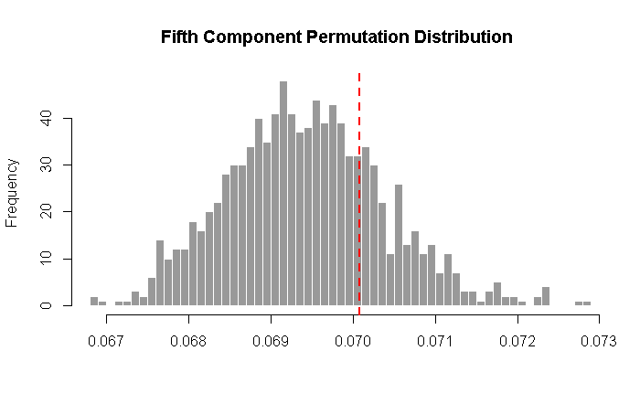

```{r setup, include=FALSE}
library(knitr)
knitr::opts_chunk$set(echo = FALSE)
library(tidyverse)
library(ggplot2)
library(ExPosition)
library(ours)
library(factoextra)
library(gridExtra)
library(grid)
library(ggcorrplot)
library(ggrepel)
library(kableExtra)

perp.segment.coord <- function(x0, y0, a=0,b=1){
  #finds endpoint for a perpendicular segment from the point (x0,y0) to the line
  # defined by lm.mod as y=a+b*x
  x1 <- (x0+b*y0-a*b)/(1+b^2)
  y1 <- a + b*x1
  list(x0=x0, y0=y0, x1=x1, y1=y1)
}

load(file=paste0(Sys.getenv("ADNI_FOLDER"),"\\","amerge_subset.rda"))
load(file=paste0(Sys.getenv("ADNI_FOLDER"),"\\","variable_type_map.rda"))
```

### Where to find everything

* Generally: https://github.com/derekbeaton/workshops
* Today: https://github.com/derekbeaton/Workshops/tree/master/RTC/PCA_MCA_Resampling

### Some set up

* Use RStudio (makes it easy)
* You can pull from the Git repo
  + Or copy individual files
* Make .Renviron file
  + Points to locations outside the repo
* Run "/R/0_Create_ADNI_Dataset.R" first
  + Then either run this .Rmd or
  + Run scripts in order
* Use of the ADNI data
  + Via the 'ADNIMERGE' package

### An advertisement

* Lots of really cool R & RStudio stuff
* This presentation is 90% reproducible
  + Resampling is painful
* R & RStudio "Magic" BrainHackTO tutorial
  + Jenny Rieck & I
  + May 21 or 22
  + Possibly sold out?
  + We'll make stuff available

### Motivation for today

* Single mixed data set
  + In various pieces
  + Build up
* Not everything is a number
  + We need to recognize this


### Overview

* Introduction
* PCA
* CA 
* Resampling
* Final notes

# Introduction

## History

### Prehistory

* Basis: 
  + Hotelling (1933)
  + Eckart & Yong (1936)
* Traces back to
  + Cauchy (1829)
  + Galton (1859)
  + K. Pearson (1901)
  + Spearman (1904)
  
### History
  
* "Modern form" of PCA & factor analyses
  + Thurstone (1934)
  + Fisher (1940)
  + Tucker (too many to list)
  + Many others in 1940s-1960s
* CA
  + Hirschfeld (1935)
  + Guttman (1941)
  + Burt (1950)
  + Benzecri (1964)
  + Escofier (1965)
* See Lebart's History & Prehistory of CA: http://www.dtmvic.com/doc/About_the_History_of_CA.pdf

### Now & The Future

* PCA is always cool.
* See the final slides for related methods
  + PCA makes you familiar with all of them
  + CA makes you an expert with all of them

## PCA & CA

### PCA & CA

* Visualize multiple/high dimensions
* Dimensionality reduction
* Matrix factorization
* Unsupervised learning

### PCA & CA

* Find "components"
  + Components are new variables that are combinations of the original variables
* Components explain maximal variance
  + Conditional to orthogonality
* So what's the difference?

### PCA vs CA

* PCA: For generally continuous (interval scale) data
* CA: For (almost) everything else
  + And also for continuous data!

### Under the hood

* The eigenvalue decomposition (EVD)
  + Requires squares, symmetric, and positive semi definite
  + Generally correlation or covariance
* The singular value decomposition (SVD)
  + Works with rectangular tables
* A generalized SVD
  + Apply constraints (weights) to rows & columns of rectangular table
  + Required for CA and fancier PCA-like techniques & extensions

## Definitions

### Terms I will use today

* Component scores
  + Values assigned to rows (PCA & CA) or columns (CA) scaled by variance
* Correlation loadings (PCA)
  + Correlation of original data with row component scores (observations)
* Explained variance
  + Eigenvalues
  + How much of the total variance per component
  + Variance = Sums of squares
* Magic

## Software

### Today

* ExPosition
  + Family of packages
  + Includes resampling
  + Lots of PCA & CA techniques
* factoextra
  + Awesome ggplot2 visualizers for ExPosition
  + http://www.alboukadel.com/ & http://www.sthda.com/english/
* ggplot2 & tidyverse
* ours
  + Developed here within ONDRI
  + New package for outliers
  + Has some important bells-and-whistles
* Making things look fancy:
  + kable, kableExtra, gridExtra, ggcorrplot

### Some alternatives

* FactoMineR
* ade4
* ca
* MASS
* psych
* So many others

## Data

### Typology

* SS Stevens
  + Not a boat! 
* Levels of measurement
  + Nominal (categorical)
  + Ordinal (ranked, discrete categories)
  + Interval (continuous, arbitrary 0)
  + Ratio (continuous, non-arbitrary 0)
* Excellent examples: https://en.wikipedia.org/wiki/Level_of_measurement

### Today's data


* Alzheimer's Disease Neuroimaging Initiative (ADNI)
* Data set:
  + 665 observations
  + 17 variables
* Walk through this set to tell a whole story

### Today's data

```{r}
variable_type_map_for_show <- variable_type_map
variable_type_map_for_show[variable_type_map_for_show==1] <- "YES"
variable_type_map_for_show[variable_type_map_for_show=="0"] <- ""
grid.table(variable_type_map_for_show, theme=ttheme_default(base_size=18))
```

# Principal Components Analysis

## Find a component

```{r setup_pca}
amerge_subset %>%
  select(mPACCtrailsB, FDG) ->
  trails_fdg_data

trails_fdg_data <- data.frame(TRAILS=amerge_subset$mPACCtrailsB, FDG=amerge_subset$FDG)
## center/normalize
trails_fdg_data_normed <- data.frame(TRAILS=expo.scale(as.matrix(trails_fdg_data$TRAILS),scale="SS1"), FDG=expo.scale(as.matrix(trails_fdg_data$FDG),scale="SS1"))

eigen_results <- eigen(crossprod(as.matrix(trails_fdg_data_normed)))
eigen_results$slopes[1] <- eigen_results$vectors[1,1]/eigen_results$vectors[2,1]  # calc slopes as ratios
eigen_results$slopes[2] <- eigen_results$vectors[1,1]/eigen_results$vectors[1,2]  # calc slopes as ratios
```

### Let's dive in

* We'll start with just two variables:
* Trails
  + Neuropsych test
  + Executive function
* FDG
  + PET imaging; brain function
  + Average of several brain regions

***

```{r}
g <- ggplot(trails_fdg_data, mapping=aes(x = TRAILS, y = FDG)) + 
  geom_point(alpha = 1/3) + 
  coord_fixed() + 
  theme_bw()
g
```

***

```{r}
g <- ggplot(trails_fdg_data_normed, mapping=aes(x = TRAILS, y = FDG)) + 
  geom_point(alpha = 1/3) + 
  stat_ellipse(type = "norm", alpha=0) + ## such a lazy hack...
  geom_segment(data=as.data.frame(perp.segment.coord(trails_fdg_data_normed$TRAILS, trails_fdg_data_normed$FDG, 0, eigen_results$slopes[1])), aes(x = x0, y = y0, xend = x1, yend = y1), alpha = 0) +
  theme_bw() +
  coord_fixed() + 
  geom_hline(yintercept = 0, color="grey80") + geom_vline(xintercept = 0, "grey80")
g
```

***

```{r}
g <- g + geom_abline(intercept = 0, slope = eigen_results$slopes[1], colour = "mediumorchid4", size=2)  # plot pc1
g
```


***

```{r}
trails.from.fdg <- lm(trails_fdg_data_normed$TRAILS ~ trails_fdg_data_normed$FDG)
fdg.from.trails <- lm(trails_fdg_data_normed$FDG ~ trails_fdg_data_normed$TRAILS)

g + 
  geom_segment(x = min(trails_fdg_data_normed$TRAILS), y = min(fdg.from.trails$fitted.values), xend = max(trails_fdg_data_normed$TRAILS), yend = max(fdg.from.trails$fitted.values), colour = "orange", size=2) +
  
  geom_segment(y = min(trails_fdg_data_normed$FDG), x = min(trails.from.fdg$fitted.values), yend = max(trails_fdg_data_normed$FDG), xend = max(trails.from.fdg$fitted.values), colour = "red", size=2) +
  
  geom_segment(aes(x = max(trails_fdg_data_normed$TRAILS) * .9, y = max(fdg.from.trails$fitted.values) * -.9, xend = max(trails_fdg_data_normed$TRAILS), yend = max(fdg.from.trails$fitted.values)), 
                             colour = "orange", 
                             size=0.5) +
  
  geom_segment(aes(y = max(trails_fdg_data_normed$FDG) * .9, x = max(trails.from.fdg$fitted.values) * -.9, yend = max(trails_fdg_data_normed$FDG), xend = max(trails.from.fdg$fitted.values)), 
                             colour = "red", 
                             size=0.5) +
  geom_label(aes(x = max(trails_fdg_data_normed$TRAILS) * .6, y = max(fdg.from.trails$fitted.values) * -.8, label = "FDG ~ TRAILS"), 
             hjust = 0, 
             vjust = 0.5, 
             lineheight = 0.8,
             colour = "orange", 
             fill = "white", 
             label.size = NA, 
             size = 5) +
  
  geom_label(aes(y = max(trails_fdg_data_normed$FDG) * .9, x = max(trails.from.fdg$fitted.values) * -.9, label = "TRAILS ~ FDG"), 
             hjust = 0, 
             vjust = 0.5, 
             lineheight = 0.8,
             colour = "red", 
             fill = "white", 
             label.size = NA, 
             size = 5)
  
```

***

```{r}
g
```

***

```{r}


g <- g + geom_segment(data=data.frame(x0=trails_fdg_data_normed$TRAILS, y0=trails_fdg_data_normed$FDG, x1=0, y1=trails_fdg_data_normed$FDG), aes(x = x0, y = y0, xend = x1, yend = y1), colour = "grey80", size=1, alpha = 1/3)
g


```

***

```{r}

g <- g + geom_segment(data=data.frame(x0=trails_fdg_data_normed$TRAILS, y0=trails_fdg_data_normed$FDG, x1=trails_fdg_data_normed$TRAILS, y1=0), aes(x = x0, y = y0, xend = x1, yend = y1), colour = "grey80", size=1, alpha = 1/3)
g

```

***

```{r}
g <- g + geom_abline(intercept = 0, slope = eigen_results$slopes[2], colour = "olivedrab4", size=1)  # plot pc2
g

```

## Interpretation

```{r small_pca}
pca_results <- epPCA(trails_fdg_data, graphs=F)
```

***

```{r}
participant_component_scores <- data.frame(COMPONENT_1=pca_results$ExPosition.Data$fi[,1], 
                                   COMPONENT_2=pca_results$ExPosition.Data$fi[,2])
rownames(participant_component_scores) <- rownames(amerge_subset)
  
g <- ggplot(participant_component_scores, mapping=aes(x = COMPONENT_1, y = COMPONENT_2)) + 
  geom_hline(yintercept = 0, color = "mediumorchid4", size=2) + 
  geom_vline(xintercept = 0, color = "olivedrab4", size=1) + 
  geom_point(alpha = 1/3) + 
  geom_segment(data=as.data.frame(
                perp.segment.coord(participant_component_scores$COMPONENT_1, 
                participant_component_scores$COMPONENT_2, 
                0, 
                0)), 
               aes(x = x0, y = y0, xend = x1, yend = y1), alpha = 0) +
  theme_minimal() +
  theme(panel.grid.major = element_blank(), panel.grid.minor = element_blank(),
        axis.text.x=element_blank(),
        axis.ticks.x=element_blank(),
        axis.text.y=element_blank(),
        axis.ticks.y=element_blank()) +
  xlab(paste0("Component 1. Explained variance: ", round(pca_results$ExPosition.Data$t[1], digits=2),"%")) +
  ylab(paste0("Component 2. Explained variance: ", round(pca_results$ExPosition.Data$t[2], digits=2),"%")) +
  ggtitle("PCA of Trails & FDG:\nParticipants' Component Scores") 
g
```


***

```{r}

## these two:
# far_comp_1 <- "4039"
# close_comp_1 <- "4755"

g +
  geom_segment(data=data.frame(x0=participant_component_scores$COMPONENT_1, 
                      y0=participant_component_scores$COMPONENT_2, 
                      x1=0, 
                      y1=participant_component_scores$COMPONENT_2), 
    aes(x = x0, y = y0, xend = x1, yend = y1), alpha = 1/3, color = "mediumorchid4") +
  
  geom_segment(aes(x=participant_component_scores["4039",1],
                   y=participant_component_scores["4039",2] * 2,
                   xend=participant_component_scores["4039",1],
                   yend=participant_component_scores["4039",2]),
                             colour = "red",
                             size=1) +
  geom_label(aes(x=participant_component_scores["4039",1] * .8,
                   y=participant_component_scores["4039",2] * 2,
                    label="4039: FAR AWAY!"),
                   hjust = 0,
                   vjust = 0.5,
                   lineheight = 0.8,
                   colour = "red",
                   fill = "white",
                   label.size = NA,
                   size = 5)  +
  
  geom_segment(aes(x=participant_component_scores["4755",1] * 2,
                   y=participant_component_scores["4755",2],
                   xend=participant_component_scores["4755",1],
                   yend=participant_component_scores["4755",2]),
                             colour = "orange",
                             size=1) +
  geom_label(aes(x=participant_component_scores["4755",1] * 2,
                   y=participant_component_scores["4755",2],
                    label="4755: CLOSE!"),
                   hjust = 0,
                   vjust = 0.5,
                   lineheight = 0.8,
                   colour = "orange",
                   fill = "white",
                   label.size = NA,
                   size = 5)
```

*** 

```{r}
g + 
  geom_segment(data=data.frame(x0=participant_component_scores$COMPONENT_1, 
                     y0=participant_component_scores$COMPONENT_2, 
                     x1=participant_component_scores$COMPONENT_1, 
                     y1=0), 
    aes(x = x0, y = y0, xend = x1, yend = y1), alpha = 1/3, color = "olivedrab4")  +
  
  geom_segment(aes(x=participant_component_scores["4039",1],
                   y=participant_component_scores["4039",2] * 2,
                   xend=participant_component_scores["4039",1],
                   yend=participant_component_scores["4039",2]),
                             colour = "red",
                             size=1) +
  geom_label(aes(x=participant_component_scores["4039",1] * .8,
                   y=participant_component_scores["4039",2] * 2,
                    label="4039: CLOSE!"),
                   hjust = 0,
                   vjust = 0.5,
                   lineheight = 0.8,
                   colour = "red",
                   fill = "white",
                   label.size = NA,
                   size = 5)  +
  
  geom_segment(aes(x=participant_component_scores["4755",1] * 2,
                   y=participant_component_scores["4755",2],
                   xend=participant_component_scores["4755",1],
                   yend=participant_component_scores["4755",2]),
                             colour = "orange",
                             size=1) +
  geom_label(aes(x=participant_component_scores["4755",1] * 2,
                   y=participant_component_scores["4755",2],
                    label="4755: FAR AWAY!"),
                   hjust = 0,
                   vjust = 0.5,
                   lineheight = 0.8,
                   colour = "orange",
                   fill = "white",
                   label.size = NA,
                   size = 5)


```


***


```{r}
var_cors <- fviz_pca_var(pca_results) +
  xlab(paste0("Component 1. Explained variance: ", round(pca_results$ExPosition.Data$t[1], digits=2),"%")) +
  ylab(paste0("Component 2. Explained variance: ", round(pca_results$ExPosition.Data$t[2], digits=2),"%")) +
  ggtitle("PCA:\nVariable-Component Correlations")
var_cors
```

***

```{r}

t <- textGrob("")

layout_side_by_side <- rbind(
  c(1,1,1,1,4,4), 
  c(2,2,2,2,5,5), 
  c(2,2,2,2,5,5),
  c(2,2,2,2,5,5),
  c(2,2,2,2,5,5),
  c(2,2,2,2,5,5), 
  c(2,2,2,2,5,5), 
  c(2,2,2,2,5,5), 
  c(2,2,2,2,5,5), 
  c(3,3,3,3,6,6))


new_g <- g + ggtitle("") + ylab("") + xlab("")
new_var_cors <- var_cors + ggtitle("") + xlab("") + ylab("")

grid.arrange(t,
           new_g,
           t,
           t,
           new_var_cors,
           t, layout_matrix = layout_side_by_side, top="PCA:\nTrails & FDG", bottom=paste0("Component 1. Explained variance: ", round(pca_results$ExPosition.Data$t[1], digits=2),"%"), left=paste0("Component 2. Explained variance: ", round(pca_results$ExPosition.Data$t[2], digits=2),"%"))


```

***

```{r}

## edit new_g
x_max <- max(participant_component_scores[,1]) * .9
x_min <- min(participant_component_scores[,1]) * .9
y_max <- max(participant_component_scores[,2]) * .9
y_min <- min(participant_component_scores[,2]) * .9
  
new_g_annotate <- new_g + 
  geom_label(aes(x=x_max,
                   y=0,
                    label="Low on both"),
                   hjust = 0.5,
                   vjust = 0.75,
                   lineheight = 0.8,
                   colour = "red",
                   fill = "white",
                   label.size = NA,
                   size = 4) +
  geom_label(aes(x=x_min,
                   y=0,
                    label="High on both"),
                   hjust = 0.25,
                   vjust = -0.25,
                   lineheight = 0.8,
                   colour = "red",
                   fill = "white",
                   label.size = NA,
                   size = 6) +
  geom_label(aes(x=0,
                   y=0,
                    label="Average"),
                   hjust = 0.5,
                   vjust = 0,
                   lineheight = 0.8,
                   colour = "red",
                   fill = "white",
                   label.size = NA,
                   size = 5) +
  geom_label(aes(x=0,
                   y=y_max,
                    label="+TRAILS\n-FDG"),
                   hjust = 0.5,
                   vjust = 0,
                   lineheight = 0.8,
                   colour = "red",
                   fill = "white",
                   label.size = NA,
                   size = 3) +
  geom_label(aes(x=0,
                   y=y_min,
                    label="+FDG\n-TRAILS"),
                   hjust = 0.5,
                   vjust = 0,
                   lineheight = 0.8,
                   colour = "red",
                   fill = "white",
                   label.size = NA,
                   size = 3)

grid.arrange(t,
           new_g_annotate,
           t,
           t,
           new_var_cors,
           t, layout_matrix = layout_side_by_side, top="PCA:\nTrails & FDG", bottom=paste0("Component 1. Explained variance: ", round(pca_results$ExPosition.Data$t[1], digits=2),"%"), left=paste0("Component 2. Explained variance: ", round(pca_results$ExPosition.Data$t[2], digits=2),"%"))

```


## Example
```{r example_pca_setup}
# select the continuous only subset
continuous_data_subset <- amerge_subset[,which(variable_type_map[,"Continuous"]==1)]
pca_results <- epPCA(continuous_data_subset, graphs=F)
```

### Scaling up

* Scale up: MORE DATA!
* All of the continuous variables
  
### Scaling up

```{r}
grid.table(
  round(
    continuous_data_subset[which(amerge_subset$DX=="Dementia" & amerge_subset$PTRACCAT=="Black"):(which(amerge_subset$DX=="Dementia" & amerge_subset$PTRACCAT=="Black")+10)-5,], digits=2), 
  theme=ttheme_default(base_size=12)
  )
```

### A new plot

* Scree (Cattell)
* Junk at the bottom of a slope
* Shows us explained variance (%) per component
  
<!-- `pca_results <- epPCA(continuous_data_subset, graphs=F)` -->

***

<!-- `fviz_screeplot(pca_results, addlabels = TRUE)` -->

```{r}
fviz_screeplot(pca_results, addlabels = TRUE)
```

***

<!-- `fviz_pca_var(pca_results)` -->

```{r}
var_cors <- fviz_pca_var(pca_results) +
  xlab(paste0("Component 1. Explained variance: ", round(pca_results$ExPosition.Data$t[1], digits=2),"%")) +
  ylab(paste0("Component 2. Explained variance: ", round(pca_results$ExPosition.Data$t[2], digits=2),"%")) +
  ggtitle("PCA:\nVariable-Component Correlations")

var_cors
```

***

```{r}
ggcorrplot(cor(continuous_data_subset), hc.order = TRUE, type = "lower", lab = TRUE, outline.col = "white") +
  theme(panel.grid.major = element_blank(), panel.grid.minor = element_blank())

```

***

<!-- `fviz_pca_ind(pca_results, alpha.ind = 1/3, label="none")` -->

```{r}
comp_scores <- fviz_pca_ind(pca_results, alpha.ind = 1/3, label="none") +
  theme(panel.grid.major = element_blank(), panel.grid.minor = element_blank(),
        axis.text.x=element_blank(),
        axis.ticks.x=element_blank(),
        axis.text.y=element_blank(),
        axis.ticks.y=element_blank()) +
  xlab(paste0("Component 1. Explained variance: ", round(pca_results$ExPosition.Data$t[1], digits=2),"%")) +
  ylab(paste0("Component 2. Explained variance: ", round(pca_results$ExPosition.Data$t[2], digits=2),"%")) +
  ggtitle("PCA:\nParticipants Component Scores")

comp_scores
```

***

```{r}

t <- textGrob("")

layout_side_by_side <- rbind(
  c(1,1,1,1,4,4), 
  c(2,2,2,2,5,5), 
  c(2,2,2,2,5,5),
  c(2,2,2,2,5,5),
  c(2,2,2,2,5,5),
  c(2,2,2,2,5,5), 
  c(2,2,2,2,5,5), 
  c(2,2,2,2,5,5), 
  c(2,2,2,2,5,5), 
  c(3,3,3,3,6,6))


new_g <- comp_scores + ggtitle("") + ylab("") + xlab("")
new_var_cors <- var_cors + ggtitle("") + xlab("") + ylab("")

grid.arrange(t,
           new_g,
           t,
           t,
           new_var_cors,
           t, layout_matrix = layout_side_by_side, top="PCA:\nTrails & FDG", bottom=paste0("Component 1. Explained variance: ", round(pca_results$ExPosition.Data$t[1], digits=2),"%"), left=paste0("Component 2. Explained variance: ", round(pca_results$ExPosition.Data$t[2], digits=2),"%"))

```

*** 

```{r}

participant_component_scores_long_df <- data.frame(
  COMPONENT_SCORES = c(pca_results$ExPosition.Data$fi),
  COMPONENTS = rep(as.character(1:ncol(pca_results$ExPosition.Data$fi)), each=nrow(pca_results$ExPosition.Data$fi))
)
variable_correlations_long_df <- data.frame(
  CORRELATIONS = c(cor(pca_results$ExPosition.Data$X, pca_results$ExPosition.Data$fi)),
  COMPONENTS = rep(as.character(1:ncol(pca_results$ExPosition.Data$fj)), each=nrow(pca_results$ExPosition.Data$fj)),
  NAMES = rep(as.character(rownames(pca_results$ExPosition.Data$fj)), nrow(pca_results$ExPosition.Data$fj))
)

all_comps_scores <- ggplot( participant_component_scores_long_df, aes(x = 0, y = COMPONENT_SCORES) ) + 
  geom_violin(draw_quantiles = c(.25, .5, .75), adjust = .5, trim = T) + 
  geom_dotplot(binaxis='y', stackdir='center', dotsize=1, alpha=1/5, binwidth = 1/10, color = "mediumorchid4") + 
  theme(axis.text.x=element_blank(),
        axis.ticks.x=element_blank(),
        axis.text.y=element_blank(),
        axis.ticks.y=element_blank()) +
  xlab("") +
  facet_grid(~factor(COMPONENTS))

all_vars_corrs <- ggplot( variable_correlations_long_df, aes(x = 0, y = CORRELATIONS, label=NAMES) ) + 
  geom_point() + 
  geom_text_repel(size=3.5, box.padding = 0.5, point.padding = 0.5, direction = "both") +
  coord_cartesian(ylim = c(-1.1,1.1)) +
  theme(axis.text.x=element_blank(),
        axis.ticks.x=element_blank(),
        axis.text.y=element_blank(),
        axis.ticks.y=element_blank()) +
  xlab("") +
  facet_grid(~factor(COMPONENTS))


grid.arrange(all_comps_scores, all_vars_corrs, nrow=2)

```


# Correspondence analyses

### CA

* Like PCA in many ways
* Slightly different interpretations
* So much cooler
  + Handles all types of data

## Small examples

```{r small_mca_setup}
apoe_dx_data <- amerge_subset[,c("DX","PTRACCAT")]
apoe_dx_disjunctive_data <- makeNominalData(apoe_dx_data)
# colnames(apoe_dx_disjunctive_data) <- gsub("\\.","_",colnames(apoe_dx_disjunctive_data))

illustrative_apoe_dx_subtable <- apoe_dx_data[which(amerge_subset$DX=="Dementia" & amerge_subset$PTRACCAT=="Black"):(which(amerge_subset$DX=="Dementia" & amerge_subset$PTRACCAT=="Black")+10)-5,]

illustrative_apoe_dx_disjunctive_subtable <- apoe_dx_disjunctive_data[which(amerge_subset$DX=="Dementia" & amerge_subset$PTRACCAT=="Black"):(which(amerge_subset$DX=="Dementia" & amerge_subset$PTRACCAT=="Black")+10)-5,]
```

### Illustrative data

```{r}

kable(illustrative_apoe_dx_subtable, "latex", booktabs=T) %>% 
  kable_styling(font_size = 10, position = "center")

```

### Disjunctive data

```{r}
kable(illustrative_apoe_dx_disjunctive_subtable, "latex", booktabs=T) %>% 
  kable_styling(latex_options="scale_down", position = "center")
```

### Disjunctive data

```{r}
kable(illustrative_apoe_dx_disjunctive_subtable, "latex", booktabs=T) %>% 
  kable_styling(latex_options="scale_down", position = "center")
```

* Row sums are total number of *original* variables
* Sum within a variable (e.g. DX) is total number of rows
* Sum of the table is rows $\times$ columns

### A criminal idea: PCA

* "coding categorical variables with the indicator matrix of dummy variables and considering them as Gaussian, for instance, is almost a crime."
  + "Jan de Leeuw and the French School of Data Analysis" (Husson, Josse, Saporta)
* Let's commit a crime!

***

```{r}
## show PCA
pca_results <- epPCA(apoe_dx_disjunctive_data, graphs=F)
pca_disj_scree <- fviz_screeplot(pca_results, addlabels = TRUE)

pca_disj_var_cors <- fviz_pca_var(pca_results) +
  xlab(paste0("Component 1. Explained variance: ", round(pca_results$ExPosition.Data$t[1], digits=2),"%")) +
  ylab(paste0("Component 2. Explained variance: ", round(pca_results$ExPosition.Data$t[2], digits=2),"%")) +
  ggtitle("PCA:\nVariable-Component Correlations")

grid.arrange(pca_disj_scree, pca_disj_var_cors, ncol=2)

```

### Why is that a bad idea?

```{r}
 
  cor_disj_tab <- as.data.frame(round(cor(apoe_dx_disjunctive_data),digits=3))
  cross_disj_tab <- as.data.frame(crossprod(apoe_dx_disjunctive_data))

find_cell <- function(table, row, col, name="core-fg"){
  l <- table$layout
  which(l$t==row & l$l==col & l$name==name)
}

cor_grob <- tableGrob(cor_disj_tab, theme=ttheme_default(base_size=12))
cross_grob <- tableGrob(cross_disj_tab, theme=ttheme_default(base_size=12))

cor_grob$grobs[find_cell(cor_grob, 5, 4, "core-bg")][[1]][["gp"]] <-cor_grob$grobs[find_cell(cor_grob, 3, 2, "core-bg")][[1]][["gp"]] <-
  gpar(fill="darkolivegreen1", col = "darkolivegreen4", lwd=5, fontsize=15, fontface="bold") ->
  cross_grob$grobs[find_cell(cross_grob, 3, 2, "core-bg")][[1]][["gp"]] ->
  cross_grob$grobs[find_cell(cross_grob, 5, 4, "core-bg")][[1]][["gp"]]

t <- textGrob("")
layout_side_by_side <- rbind(
  c(2,3,3,3,3,4), 
  c(2,3,3,3,3,4), 
  c(5,6,6,6,6,7),
  c(5,6,6,6,6,7),
  c(8,8,8,8,8,8)) - 1

grid.arrange(
             t,
             cor_grob,
             t,
             t,
             cross_grob,
             t,
             t, layout_matrix = layout_side_by_side)

```

### A better idea

* Correspondence analysis (CA)
  + Think of it as a $\chi^2$ PCA
* Designed to handle things that look like counts
  + That includes categories
  + And some other things
* Row and column component scores exist on same scale
  + CA is a *bivariate* technique

```{r}
ca_results <- epCA(apoe_dx_disjunctive_data, graphs=F)
```

***

```{r}
fviz_screeplot(ca_results, addlabels = TRUE)
```

***

```{r}
fviz_ca_col(ca_results) +
  coord_cartesian(xlim=c(ca_results$Plotting.Data$constraints$minx, ca_results$Plotting.Data$constraints$maxx), ylim = c(ca_results$Plotting.Data$constraints$miny, ca_results$Plotting.Data$constraints$maxy)) +
  theme(panel.grid.major = element_blank(), panel.grid.minor = element_blank(),
        axis.text.x=element_blank(),
        axis.ticks.x=element_blank(),
        axis.text.y=element_blank(),
        axis.ticks.y=element_blank()) +
  xlim(c(ca_results$Plotting.Data$constraints$minx, ca_results$Plotting.Data$constraints$maxx)) +
  ylim(c(ca_results$Plotting.Data$constraints$miny, ca_results$Plotting.Data$constraints$maxy)) +
  xlab(paste0("Component 1. Explained variance: ", round(ca_results$ExPosition.Data$t[1], digits=2),"%")) +
  ylab(paste0("Component 2. Explained variance: ", round(ca_results$ExPosition.Data$t[2], digits=2),"%")) +
  ggtitle("CA:\nVariable Component Scores")
```

*** 

```{r}

grid.arrange(
  tableGrob(illustrative_apoe_dx_subtable, theme = ttheme_default(base_size=10)),
  textGrob(""),
  textGrob(""),
  fviz_screeplot(ca_results, addlabels = TRUE),
  tableGrob(illustrative_apoe_dx_disjunctive_subtable, theme = ttheme_default(base_size=7)),
  textGrob(""),
  nrow=1,
  layout_matrix = rbind(c(1,1,2,2,2,2), c(1,1,3,3,4,4), c(5,5,5,5,4,4), c(5,5,5,6,6,6))
  )

```

### Multiple correspondence analysis

* An extension of CA
* Accomodates multiple categorical variables (CA only does 2)
* Corrects the dimensionality
* Has nearly magical properties (we'll see later)

```{r}
mca_results <- epMCA(apoe_dx_data, graphs=F)
```

***

```{r}
mca_scree_disj <- fviz_screeplot(mca_results, addlabels=TRUE)
mca_scree_disj
```

***

```{r}
mca_var <- fviz_mca_var(mca_results) +
  coord_cartesian(xlim=c(mca_results$Plotting.Data$constraints$minx, mca_results$Plotting.Data$constraints$maxx), ylim = c(mca_results$Plotting.Data$constraints$miny, mca_results$Plotting.Data$constraints$maxy)) +
  theme(panel.grid.major = element_blank(), panel.grid.minor = element_blank(),
        axis.text.x=element_blank(),
        axis.ticks.x=element_blank(),
        axis.text.y=element_blank(),
        axis.ticks.y=element_blank()) +
  xlab(paste0("Component 1. Explained variance: ", round(mca_results$ExPosition.Data$t[1], digits=2),"%")) +
  ylab(paste0("Component 2. Explained variance: ", round(mca_results$ExPosition.Data$t[2], digits=2),"%")) +
  ggtitle("MCA:\nVariable Component Scores")

mca_var

```

### New interpretations


***

```{r}
mca_var +
  geom_segment(aes(x = 0, y = 0, xend=mca_results$ExPosition.Data$fj[7,1],
                   yend=mca_results$ExPosition.Data$fj[7,2]),
               color="purple") + 
  geom_label(aes(x=0,
                   y=0,
                    label="Common"),
                   hjust = 0.5,
                   vjust = 0,
                   lineheight = 0.8,
                   colour = "black",
                   fill = "white",
                   label.size = NA,
                   size = 5) +
  geom_label(aes(x=mca_results$ExPosition.Data$fj[7,1] * .9,
                   y=mca_results$ExPosition.Data$fj[7,2] * .9,
                    label="Rare variable/level"),
                   hjust = 0.5,
                   vjust = 1.1,
                   lineheight = 0.8,
                   colour = "purple",
                   fill = "white",
                   label.size = NA,
                   size = 5)
```

***

```{r}

mca_ind <- fviz_mca_ind(mca_results) +
  theme(panel.grid.major = element_blank(), panel.grid.minor = element_blank(),
        axis.text.x=element_blank(),
        axis.ticks.x=element_blank(),
        axis.text.y=element_blank(),
        axis.ticks.y=element_blank()) +
  xlim(c(mca_results$Plotting.Data$constraints$minx, mca_results$Plotting.Data$constraints$maxx)) +
  ylim(c(mca_results$Plotting.Data$constraints$miny, mca_results$Plotting.Data$constraints$maxy)) +
  xlab(paste0("Component 1. Explained variance: ", round(mca_results$ExPosition.Data$t[1], digits=2),"%")) +
  ylab(paste0("Component 2. Explained variance: ", round(mca_results$ExPosition.Data$t[2], digits=2),"%")) +
  ggtitle("MCA:\nParticipants Component Scores")

mca_ind
```

***

```{r}
mca_ind +
  geom_segment(aes(x = 0, y = 0, xend=mca_results$ExPosition.Data$fi["5037",1],
                   yend=mca_results$ExPosition.Data$fi["5037",2]),
               color="green") + 
  geom_segment(aes(x = 0, y = 0, xend=mca_results$ExPosition.Data$fi["4021",1],
                   yend=mca_results$ExPosition.Data$fi["4021",2]),
               color="green") + 
  geom_label(aes(x=0,
                   y=0,
                    label="Common"),
                   hjust = 0.5,
                   vjust = 0,
                   lineheight = 0.8,
                   colour = "black",
                   fill = "white",
                   label.size = NA,
                   size = 5) +
  geom_label(aes(x=mca_results$ExPosition.Data$fi["4021",1] * .9,
                   y=mca_results$ExPosition.Data$fi["4021",2] * .9,
                    label="Rare observations"),
                   hjust = -.1,
                   vjust = -1.75,
                   lineheight = 0.8,
                   colour = "green",
                   fill = "white",
                   label.size = NA,
                   size = 5)
```

### Why does it look like that?

***

```{r}
unique_mca <- unique(apoe_dx_disjunctive_data)
rownames(unique_mca) <- NULL
kable(unique_mca, "latex", booktabs=T) %>%
  kable_styling(latex_options="scale_down", position = "center")
```
These are *all* the possible combinations from all 665

### Compare the results

```{r}
grid.arrange(mca_var, pca_disj_var_cors, ncol=2)
```

### Compare the results

```{r}
mca_pca_cor_tab <- as.data.frame(cor(mca_results$ExPosition.Data$fi, pca_results$ExPosition.Data$fi))
rownames(mca_pca_cor_tab) <- paste0("MCA Comp. ", 1:nrow(mca_pca_cor_tab))
colnames(mca_pca_cor_tab) <- paste0("PCA Comp. ", 1:ncol(mca_pca_cor_tab))
kable(mca_pca_cor_tab, "latex", digits = 2, booktabs=T) %>%
  kable_styling(latex_options="scale_down", position = "center")
```

* CA & MCA produce identical results, except MCA:
  + Drops components
  + Corrects explained variance


## Example
```{r}
categorical_data_subset <- amerge_subset[,which(variable_type_map[,"Categorical"]==1)]
mca_results <- epMCA(categorical_data_subset, graphs=F)
```

### Scaling up


```{r}
kable(categorical_data_subset[which(amerge_subset$DX=="Dementia" & amerge_subset$PTRACCAT=="Black"):(which(amerge_subset$DX=="Dementia" & amerge_subset$PTRACCAT=="Black")+10)-5,],"latex", booktabs=T) %>%
  kable_styling(font_size = 7, position = "center")
```

***

```{r}
fviz_screeplot(mca_results, addlabels=TRUE)
```

***

```{r}
mca_vars <- fviz_mca_var(mca_results, repel = T) +
  coord_cartesian(xlim=c(mca_results$Plotting.Data$constraints$minx, mca_results$Plotting.Data$constraints$maxx), ylim = c(mca_results$Plotting.Data$constraints$miny, mca_results$Plotting.Data$constraints$maxy)) +
  theme(panel.grid.major = element_blank(), panel.grid.minor = element_blank(),
        axis.text.x=element_blank(),
        axis.ticks.x=element_blank(),
        axis.text.y=element_blank(),
        axis.ticks.y=element_blank()) +
  xlab(paste0("Component 1. Explained variance: ", round(mca_results$ExPosition.Data$t[1], digits=2),"%")) +
  ylab(paste0("Component 2. Explained variance: ", round(mca_results$ExPosition.Data$t[2], digits=2),"%")) +
  ggtitle("MCA:\nVariable Component Scores")

mca_vars
```

***

```{r}

mca_inds <- fviz_mca_ind(mca_results) +
  theme(panel.grid.major = element_blank(), panel.grid.minor = element_blank(),
        axis.text.x=element_blank(),
        axis.ticks.x=element_blank(),
        axis.text.y=element_blank(),
        axis.ticks.y=element_blank()) +
  xlim(c(mca_results$Plotting.Data$constraints$minx, mca_results$Plotting.Data$constraints$maxx)) +
  ylim(c(mca_results$Plotting.Data$constraints$miny, mca_results$Plotting.Data$constraints$maxy)) +
  xlab(paste0("Component 1. Explained variance: ", round(mca_results$ExPosition.Data$t[1], digits=2),"%")) +
  ylab(paste0("Component 2. Explained variance: ", round(mca_results$ExPosition.Data$t[2], digits=2),"%")) +
  ggtitle("MCA:\nParticipants Component Scores")

mca_inds
```

***

```{r}
t <- textGrob("")

layout_side_by_side <- rbind(
  c(1,1,1,1,4,4), 
  c(2,2,2,5,5,5), 
  c(2,2,2,5,5,5),
  c(2,2,2,5,5,5),
  c(2,2,2,5,5,5),
  c(2,2,2,5,5,5), 
  c(2,2,2,5,5,5), 
  c(2,2,2,5,5,5), 
  c(2,2,2,5,5,5), 
  c(3,3,3,3,6,6))


new_g <- mca_inds + ggtitle("") + ylab("") + xlab("")
new_var_cors <- mca_vars + ggtitle("") + xlab("") + ylab("")

grid.arrange(t,
           new_g,
           t,
           t,
           new_var_cors,
           t, layout_matrix = layout_side_by_side, top="MCA", bottom=paste0("Component 1. Explained variance: ", round(mca_results$ExPosition.Data$t[1], digits=2),"%"), left=paste0("Component 2. Explained variance: ", round(mca_results$ExPosition.Data$t[2], digits=2),"%"))
```

## Binomial data
```{r}
# select specific categorical data with only two levels per variable.
gender_ethnicity_data <- amerge_subset[,c("PTGENDER","PTETHCAT")]
gender_ethnicity_disjunctive_data <- makeNominalData(gender_ethnicity_data)

gender_ethnicity_binary_data <- gender_ethnicity_data
gender_ethnicity_binary_data$PTGENDER <- recode(gender_ethnicity_binary_data$PTGENDER, Male= 0,  Female = 1)
gender_ethnicity_binary_data$PTETHCAT <- recode(gender_ethnicity_binary_data$PTETHCAT, `Hisp/Latino` = 1,  `Not Hisp/Latino` = 0)

mca_results <- epMCA(gender_ethnicity_data, graphs=F)
pca_results <- epPCA(gender_ethnicity_binary_data, graphs=F)

```

### A very important detour

```{r}
kable(gender_ethnicity_data[which(amerge_subset$DX=="Dementia" & amerge_subset$PTRACCAT=="Black"):(which(amerge_subset$DX=="Dementia" & amerge_subset$PTRACCAT=="Black")+10)-5,],"latex", booktabs=T) %>%
  kable_styling(font_size = 7, position = "center")
```

\begin{center}Two variables with strictly two levels (i.e., binary data)\end{center}

### A very important detour

```{r}
kable(gender_ethnicity_disjunctive_data[which(amerge_subset$DX=="Dementia" & amerge_subset$PTRACCAT=="Black"):(which(amerge_subset$DX=="Dementia" & amerge_subset$PTRACCAT=="Black")+10)-5,],"latex", booktabs=T) %>%
  kable_styling(latex_options="scale_down", position = "center")
```

\begin{center}Disjunctive coding of two variables with strictly two levels (i.e., binary data) into four columns\end{center}

### A very important detour

```{r}
kable(gender_ethnicity_data[which(amerge_subset$DX=="Dementia" & amerge_subset$PTRACCAT=="Black"):(which(amerge_subset$DX=="Dementia" & amerge_subset$PTRACCAT=="Black")+10)-5,],"latex", booktabs=T) %>%
  kable_styling(font_size = 7, position = "center")
```

\begin{center}Two variables with strictly two levels (i.e., binary data)\end{center}

### A very important detour

```{r}
kable(gender_ethnicity_binary_data[which(amerge_subset$DX=="Dementia" & amerge_subset$PTRACCAT=="Black"):(which(amerge_subset$DX=="Dementia" & amerge_subset$PTRACCAT=="Black")+10)-5,],"latex", booktabs=T) %>%
  kable_styling(font_size = 7, position = "center")
```

\begin{center}Binary coding of two variables with strictly two levels (i.e., binary data) in two columns\end{center}

### A very important detour

```{r}
kable((gender_ethnicity_binary_data[which(amerge_subset$DX=="Dementia" & amerge_subset$PTRACCAT=="Black"):(which(amerge_subset$DX=="Dementia" & amerge_subset$PTRACCAT=="Black")+10)-5,]-1)*-1,"latex", booktabs=T) %>%
  kable_styling(font_size = 7, position = "center")
```

\begin{center}Alternate but equivalent binary coding of two variables with strictly two levels (i.e., binary data) in two columns\end{center}

### Always a bad idea?

* MCA on the disjunctive coded data
* PCA on the binary coded data

***

```{r}
mca_vars <- fviz_mca_var(mca_results, repel = T) +
  coord_cartesian(xlim=c(mca_results$Plotting.Data$constraints$minx, mca_results$Plotting.Data$constraints$maxx), ylim = c(mca_results$Plotting.Data$constraints$miny, mca_results$Plotting.Data$constraints$maxy)) +
  theme(panel.grid.major = element_blank(), panel.grid.minor = element_blank(),
        axis.text.x=element_blank(),
        axis.ticks.x=element_blank(),
        axis.text.y=element_blank(),
        axis.ticks.y=element_blank()) +
  xlab(paste0("Component 1. Explained variance: ", round(mca_results$ExPosition.Data$t[1], digits=2),"%")) +
  ylab(paste0("Component 2. Explained variance: ", round(mca_results$ExPosition.Data$t[2], digits=2),"%")) +
  ggtitle("MCA:\nVariable Component Scores")


pca_vars <- fviz_pca_var(pca_results) +
  xlab(paste0("Component 1. Explained variance: ", round(pca_results$ExPosition.Data$t[1], digits=2),"%")) +
  ylab(paste0("Component 2. Explained variance: ", round(pca_results$ExPosition.Data$t[2], digits=2),"%")) +
  ggtitle("PCA:\nVariable-Component Correlations")

grid.arrange(mca_vars, pca_vars, nrow=1)

```

***

```{r}
mca_scree <- fviz_screeplot(mca_results, addlabels = TRUE) +
  ggtitle("MCA:\nScree plot")
pca_scree <- fviz_screeplot(pca_results, addlabels = TRUE) +
  ggtitle("PCA:\nScree plot")

grid.arrange(mca_scree, pca_scree, nrow=1)
```
\begin{center}Oh, weird!\end{center}

***

```{r}
mca_inds <- fviz_mca_ind(mca_results, alpha.ind = 1/3, label="none") +
  theme(panel.grid.major = element_blank(), panel.grid.minor = element_blank(),
        axis.text.x=element_blank(),
        axis.ticks.x=element_blank(),
        axis.text.y=element_blank(),
        axis.ticks.y=element_blank()) +
  xlim(c(mca_results$Plotting.Data$constraints$minx, mca_results$Plotting.Data$constraints$maxx)) +
  ylim(c(mca_results$Plotting.Data$constraints$miny, mca_results$Plotting.Data$constraints$maxy)) +
  xlab(paste0("Component 1. Explained variance: ", round(mca_results$ExPosition.Data$t[1], digits=2),"%")) +
  ylab(paste0("Component 2. Explained variance: ", round(mca_results$ExPosition.Data$t[2], digits=2),"%")) +
  ggtitle("MCA:\nParticipants Component Scores")


pca_inds <- fviz_pca_ind(pca_results, alpha.ind = 1/3, label="none") +
  theme(panel.grid.major = element_blank(), panel.grid.minor = element_blank(),
        axis.text.x=element_blank(),
        axis.ticks.x=element_blank(),
        axis.text.y=element_blank(),
        axis.ticks.y=element_blank()) +
  xlab(paste0("Component 1. Explained variance: ", round(pca_results$ExPosition.Data$t[1], digits=2),"%")) +
  ylab(paste0("Component 2. Explained variance: ", round(pca_results$ExPosition.Data$t[2], digits=2),"%")) +
  ggtitle("PCA:\nParticipants Component Scores")

grid.arrange(mca_inds, pca_inds, nrow=1)

```
\begin{center}Component 2 is "flipped" \\
We will revisit this
\end{center}

***

```{r}
mca_pca_cor_tab <- as.data.frame(cor(mca_results$ExPosition.Data$fi, pca_results$ExPosition.Data$fi))
rownames(mca_pca_cor_tab) <- paste0("MCA Comp. ", 1:nrow(mca_pca_cor_tab))
colnames(mca_pca_cor_tab) <- paste0("PCA Comp. ", 1:ncol(mca_pca_cor_tab))
kable(mca_pca_cor_tab, "latex", digits = 2, booktabs=T) %>%
  kable_styling(latex_options="scale_down", position = "center")
```
\begin{center}Oh, double weird!\end{center}

### Let's get weird

```{r}
binary_data_cor <- as.data.frame(cor(gender_ethnicity_binary_data))
kable(binary_data_cor, "latex", digits = 2, booktabs=T) %>%
  kable_styling(latex_options="scale_down", position = "center")
```

### Let's get weird

```{r}
binary_data_cor <- as.data.frame(cor(gender_ethnicity_binary_data))
kable(binary_data_cor, "latex", digits = 2, booktabs=T) %>%
  kable_styling(latex_options="scale_down", position = "center")
```

* $\phi=$ `r psych::phi(table(amerge_subset$PTGENDER, amerge_subset$PTETHCAT))`

* Deep connections between $\chi^2$, Normal, binomial (and others)

* We can expand the idea of "binary" or "binomial" 


## Continuous data
```{r}
amerge_subset %>%
  select(mPACCtrailsB, FDG) ->
  trails_fdg_data

trails_fdg_data_normed <- expo.scale(trails_fdg_data, scale=T)
trails_fdg_escofier_data <- escofier.coding(trails_fdg_data,scale=T)
```

### An old friend

```{r}
kable(trails_fdg_data_normed[which(amerge_subset$DX=="Dementia" & amerge_subset$PTRACCAT=="Black"):(which(amerge_subset$DX=="Dementia" & amerge_subset$PTRACCAT=="Black")+10)-5,],"latex", booktabs=T, digits = 2) %>%
  kable_styling(font_size = 7, position = "center")
```
\begin{center}We perform(ed) PCA on these data\end{center}

### Escofier's Geometric Magic

* One of the "fuzzy" or "bipolar" coding schemes
* Take each Z-scored continuous variable
* Duplicate it as $\begin{bmatrix} \frac{1-Z}{2} \frac{1+Z}{2}\end{bmatrix}$

### Escofier's Geometric Magic

```{r}
kable(trails_fdg_escofier_data[which(amerge_subset$DX=="Dementia" & amerge_subset$PTRACCAT=="Black"):(which(amerge_subset$DX=="Dementia" & amerge_subset$PTRACCAT=="Black")+10)-5,c(1,3,2,4)],"latex", booktabs=T, digits = 2) %>%
  kable_styling(font_size = 7, position = "center")
```


### Escofier's Geometric Magic

```{r}
kable(trails_fdg_escofier_data[which(amerge_subset$DX=="Dementia" & amerge_subset$PTRACCAT=="Black"):(which(amerge_subset$DX=="Dementia" & amerge_subset$PTRACCAT=="Black")+10)-5,c(1,3,2,4)],"latex", booktabs=T, digits = 2) %>%
  kable_styling(font_size = 7, position = "center")
```
* Row sums are total number of *original* variables
* Sum within a variable (e.g., FDG) is total number of rows
* Sum of the table is rows $\times$ columns
* *These behave like disjunctive data!*

```{r}
pca_results <- epPCA(trails_fdg_data, graphs=F)
ca_results <- epCA(trails_fdg_escofier_data, graphs=F)
```

***

```{r}
ca_vars <- fviz_ca_col(ca_results, repel = T) +
  coord_cartesian(xlim=c(ca_results$Plotting.Data$constraints$minx, ca_results$Plotting.Data$constraints$maxx), ylim = c(ca_results$Plotting.Data$constraints$miny, ca_results$Plotting.Data$constraints$maxy)) +
  theme(panel.grid.major = element_blank(), panel.grid.minor = element_blank(),
        axis.text.x=element_blank(),
        axis.ticks.x=element_blank(),
        axis.text.y=element_blank(),
        axis.ticks.y=element_blank()) +
  xlab(paste0("Component 1. Explained variance: ", round(ca_results$ExPosition.Data$t[1], digits=2),"%")) +
  ylab(paste0("Component 2. Explained variance: ", round(ca_results$ExPosition.Data$t[2], digits=2),"%")) +
  ggtitle("CA:\nVariable Component Scores")


pca_vars <- fviz_pca_var(pca_results) +
  xlab(paste0("Component 1. Explained variance: ", round(pca_results$ExPosition.Data$t[1], digits=2),"%")) +
  ylab(paste0("Component 2. Explained variance: ", round(pca_results$ExPosition.Data$t[2], digits=2),"%")) +
  ggtitle("PCA:\nVariable-Component Correlations")

grid.arrange(ca_vars, pca_vars, nrow=1)

```
\begin{center}Oh, interesting!\\
Take note: each variable has two "poles"\end{center}

***

```{r}
ca_scree <- fviz_screeplot(ca_results, addlabels = TRUE) +
  ggtitle("CA:\nScree plot")
pca_scree <- fviz_screeplot(pca_results, addlabels = TRUE) +
  ggtitle("PCA:\nScree plot")

grid.arrange(ca_scree, pca_scree, nrow=1)
```
\begin{center}Oh, weird!\end{center}

***

```{r}
ca_inds <- fviz_ca_row(ca_results, alpha.ind = 1/3, label="none") +
  theme(panel.grid.major = element_blank(), panel.grid.minor = element_blank(),
        axis.text.x=element_blank(),
        axis.ticks.x=element_blank(),
        axis.text.y=element_blank(),
        axis.ticks.y=element_blank()) +
  xlim(c(ca_results$Plotting.Data$constraints$minx, ca_results$Plotting.Data$constraints$maxx)) +
  ylim(c(ca_results$Plotting.Data$constraints$miny, ca_results$Plotting.Data$constraints$maxy)) +
  xlab(paste0("Component 1. Explained variance: ", round(ca_results$ExPosition.Data$t[1], digits=2),"%")) +
  ylab(paste0("Component 2. Explained variance: ", round(ca_results$ExPosition.Data$t[2], digits=2),"%")) +
  ggtitle("CA:\nParticipants Component Scores")


pca_inds <- fviz_pca_ind(pca_results, alpha.ind = 1/3, label="none") +
  theme(panel.grid.major = element_blank(), panel.grid.minor = element_blank(),
        axis.text.x=element_blank(),
        axis.ticks.x=element_blank(),
        axis.text.y=element_blank(),
        axis.ticks.y=element_blank()) +
  xlab(paste0("Component 1. Explained variance: ", round(pca_results$ExPosition.Data$t[1], digits=2),"%")) +
  ylab(paste0("Component 2. Explained variance: ", round(pca_results$ExPosition.Data$t[2], digits=2),"%")) +
  ggtitle("PCA:\nParticipants Component Scores")

grid.arrange(ca_inds, pca_inds, nrow=1)

```
\begin{center}Oh, double weird!\end{center}

***

```{r}
ca_inds <- fviz_ca_row(ca_results, alpha.ind = 1/3, label="none") +
  theme(panel.grid.major = element_blank(), panel.grid.minor = element_blank(),
        axis.text.x=element_blank(),
        axis.ticks.x=element_blank(),
        axis.text.y=element_blank(),
        axis.ticks.y=element_blank()) +
  xlim(c(ca_results$Plotting.Data$constraints$minx, ca_results$Plotting.Data$constraints$maxx)) +
  ylim(c(ca_results$Plotting.Data$constraints$miny, ca_results$Plotting.Data$constraints$maxy)) +
  xlab(paste0("Component 1. Explained variance: ", round(ca_results$ExPosition.Data$t[1], digits=2),"%")) +
  ylab(paste0("Component 2. Explained variance: ", round(ca_results$ExPosition.Data$t[2], digits=2),"%")) +
  ggtitle("CA:\nParticipants Component Scores")


pca_inds <- fviz_pca_ind(pca_results, alpha.ind = 1/3, label="none") +
  theme(panel.grid.major = element_blank(), panel.grid.minor = element_blank(),
        axis.text.x=element_blank(),
        axis.ticks.x=element_blank(),
        axis.text.y=element_blank(),
        axis.ticks.y=element_blank()) +
  xlab(paste0("Component 1. Explained variance: ", round(pca_results$ExPosition.Data$t[1], digits=2),"%")) +
  ylab(paste0("Component 2. Explained variance: ", round(pca_results$ExPosition.Data$t[2], digits=2),"%")) +
  ggtitle("PCA:\nParticipants Component Scores")

grid.arrange(ca_inds, pca_inds, nrow=1)

```
\begin{center}Flips: They don't matter.\end{center}

***

```{r}
ca_pca_cor_tab <- as.data.frame(cor(ca_results$ExPosition.Data$fi, pca_results$ExPosition.Data$fi))
rownames(ca_pca_cor_tab) <- paste0("CA Comp. ", 1:nrow(ca_pca_cor_tab))
colnames(ca_pca_cor_tab) <- paste0("PCA Comp. ", 1:ncol(mca_pca_cor_tab))
kable(ca_pca_cor_tab, "latex", digits = 2, booktabs=T) %>%
  kable_styling(latex_options="scale_down", position = "center")
```
\begin{center}Flips: They don't matter.\end{center}

### Escofier's Geometric Trick

* Apply PCA to continuous data or
* Apply CA to "Escofier transformed" data


## Ordinal data

```{r}
strictly_ordinal_data <- amerge_subset[,which(variable_type_map[,"Ordinal"]==1 & variable_type_map[,"Categorical"]!=1)]
strictly_ordinal_thermometer_data <- thermometer.coding(strictly_ordinal_data)
ca_results <- epCA(strictly_ordinal_thermometer_data, graphs=F)
```


### Thermometer

* For ordinal data
* Another "fuzzy" or "bipolar" coding
* More Escofier Geometric Magic
  + Subtract the maximum (minimum is now $0$)
  + $\begin{bmatrix} \frac{\texttt{max}(x)-x}{\texttt{max}} \frac{x-\texttt{min}(x)}{\texttt{max}}\end{bmatrix}$
* Apply CA


### More Geometric Magic

```{r}
kable(strictly_ordinal_data[which(amerge_subset$DX=="Dementia" & amerge_subset$PTRACCAT=="Black"):(which(amerge_subset$DX=="Dementia" & amerge_subset$PTRACCAT=="Black")+10)-5,],"latex", booktabs=T, digits = 2) %>%
  kable_styling(font_size = 7, position = "center")
```

### More Geometric Magic

```{r}
kable(strictly_ordinal_thermometer_data[which(amerge_subset$DX=="Dementia" & amerge_subset$PTRACCAT=="Black"):(which(amerge_subset$DX=="Dementia" & amerge_subset$PTRACCAT=="Black")+10)-5,c(1,5,2,6,3,7,4,8)],"latex", booktabs=T, digits = 2) %>%
  kable_styling(latex_options="scale_down", position = "center")
```

### More Geometric Magic

```{r}
kable(strictly_ordinal_thermometer_data[which(amerge_subset$DX=="Dementia" & amerge_subset$PTRACCAT=="Black"):(which(amerge_subset$DX=="Dementia" & amerge_subset$PTRACCAT=="Black")+10)-5,c(1,5,2,6,3,7,4,8)],"latex", booktabs=T, digits = 2) %>%
  kable_styling(latex_options="scale_down", position = "center")
```
* Row sums are total number of *original* variables
* Sum within a variable (e.g. EDU) is total number of rows
* Sum of the table is rows $\times$ columns
* *These behave like disjunctive data!*

### Let's take a look

***

```{r}
fviz_screeplot(ca_results, addlabels = TRUE) +
  ggtitle("CA:\nScree plot")
```

***

```{r}
ca_columns <- fviz_ca_col(ca_results) +
  coord_cartesian(xlim=c(ca_results$Plotting.Data$constraints$minx, ca_results$Plotting.Data$constraints$maxx), ylim = c(ca_results$Plotting.Data$constraints$miny, ca_results$Plotting.Data$constraints$maxy)) +
  theme(panel.grid.major = element_blank(), panel.grid.minor = element_blank(),
        axis.text.x=element_blank(),
        axis.ticks.x=element_blank(),
        axis.text.y=element_blank(),
        axis.ticks.y=element_blank()) +
  xlab(paste0("Component 1. Explained variance: ", round(ca_results$ExPosition.Data$t[1], digits=2),"%")) +
  ylab(paste0("Component 2. Explained variance: ", round(ca_results$ExPosition.Data$t[2], digits=2),"%")) +
  ggtitle("CA:\nVariable Component Scores")
ca_columns
```

***

```{r}
ca_columns + 
  geom_segment(data=data.frame(x0=ca_results$ExPosition.Data$fj[1,1], 
                               y0=ca_results$ExPosition.Data$fj[1,2], 
                               x1=ca_results$ExPosition.Data$fj[5,1], 
                               y1=ca_results$ExPosition.Data$fj[5,2]), 
               aes(x = x0, y = y0, xend = x1, yend = y1), color="red") +
  geom_segment(data=data.frame(x0=ca_results$ExPosition.Data$fj[2,1], 
                               y0=ca_results$ExPosition.Data$fj[2,2], 
                               x1=ca_results$ExPosition.Data$fj[6,1], 
                               y1=ca_results$ExPosition.Data$fj[6,2]), 
               aes(x = x0, y = y0, xend = x1, yend = y1), color="red") + 
  geom_segment(data=data.frame(x0=ca_results$ExPosition.Data$fj[3,1], 
                               y0=ca_results$ExPosition.Data$fj[3,2], 
                               x1=ca_results$ExPosition.Data$fj[7,1], 
                               y1=ca_results$ExPosition.Data$fj[7,2]), 
               aes(x = x0, y = y0, xend = x1, yend = y1), color="red") +
  geom_segment(data=data.frame(x0=ca_results$ExPosition.Data$fj[4,1], 
                               y0=ca_results$ExPosition.Data$fj[4,2], 
                               x1=ca_results$ExPosition.Data$fj[8,1], 
                               y1=ca_results$ExPosition.Data$fj[8,2]), 
               aes(x = x0, y = y0, xend = x1, yend = y1), color="red")
```

***

```{r}
plus_minus <- ifelse(grepl("\\+",rownames(ca_results$ExPosition.Data$fj)),"+","-")
ca_col_colors <- fviz_ca_col(ca_results, alpha.col = 0, labels=F, col.col = "white") +
  geom_text(aes(label=rownames(ca_results$ExPosition.Data$fj), color=plus_minus)) +
  coord_cartesian(xlim=c(ca_results$Plotting.Data$constraints$minx, ca_results$Plotting.Data$constraints$maxx), ylim = c(ca_results$Plotting.Data$constraints$miny, ca_results$Plotting.Data$constraints$maxy)) +
  theme(panel.grid.major = element_blank(), panel.grid.minor = element_blank(),
        axis.text.x=element_blank(),
        axis.ticks.x=element_blank(),
        axis.text.y=element_blank(),
        axis.ticks.y=element_blank(),
        legend.position="none") +
  xlab(paste0("Component 1. Explained variance: ", round(ca_results$ExPosition.Data$t[1], digits=2),"%")) +
  ylab(paste0("Component 2. Explained variance: ", round(ca_results$ExPosition.Data$t[2], digits=2),"%")) +
  ggtitle("CA:\nVariable Component Scores")

ca_col_colors
```

***

```{r}

ca_rows <- fviz_ca_row(ca_results, alpha.ind = 1/3, label="none") +
  theme(panel.grid.major = element_blank(), panel.grid.minor = element_blank(),
        axis.text.x=element_blank(),
        axis.ticks.x=element_blank(),
        axis.text.y=element_blank(),
        axis.ticks.y=element_blank()) +
  xlim(c(ca_results$Plotting.Data$constraints$minx, ca_results$Plotting.Data$constraints$maxx)) +
  ylim(c(ca_results$Plotting.Data$constraints$miny, ca_results$Plotting.Data$constraints$maxy)) +
  xlab(paste0("Component 1. Explained variance: ", round(ca_results$ExPosition.Data$t[1], digits=2),"%")) +
  ylab(paste0("Component 2. Explained variance: ", round(ca_results$ExPosition.Data$t[2], digits=2),"%")) +
  ggtitle("CA:\nParticipants Component Scores")

ca_rows

```

***

```{r}
t <- textGrob("")

layout_side_by_side <- rbind(
  c(1,1,1,1,4,4), 
  c(2,2,2,5,5,5), 
  c(2,2,2,5,5,5),
  c(2,2,2,5,5,5),
  c(2,2,2,5,5,5),
  c(2,2,2,5,5,5), 
  c(2,2,2,5,5,5), 
  c(2,2,2,5,5,5), 
  c(2,2,2,5,5,5), 
  c(3,3,3,3,6,6))


grid.arrange(t,
           (ca_rows + ggtitle("") + ylab("") + xlab("")),
           t,
           t,
           (ca_col_colors + ggtitle("") + xlab("") + ylab("")),
           t, layout_matrix = layout_side_by_side, top="CA", bottom=paste0("Component 1. Explained variance: ", round(ca_results$ExPosition.Data$t[1], digits=2),"%"), left=paste0("Component 2. Explained variance: ", round(ca_results$ExPosition.Data$t[2], digits=2),"%"))
```


## Ordinal vs. Disjunctive
```{r}
ordinal_or_categorical_data <- amerge_subset[,which(variable_type_map[,"Ordinal"]==1 & variable_type_map[,"Categorical"]==1)]

ordinal_or_categorical_thermometer_data <- thermometer.coding(ordinal_or_categorical_data)
ordinal_or_categorical_disjunctive_data <- make.data.nominal(ordinal_or_categorical_data)

thermometer_ca_results <- epCA(ordinal_or_categorical_thermometer_data, graphs=F)
mca_results <- epMCA(ordinal_or_categorical_data, graphs=F)
```


### Thermometer vs. Disjunctive

* Sometimes data could be either
* Let's analyze it both ways

***

```{r}
kable(ordinal_or_categorical_data[which(amerge_subset$DX=="Dementia" & amerge_subset$PTRACCAT=="Black"):(which(amerge_subset$DX=="Dementia" & amerge_subset$PTRACCAT=="Black")+10)-5,], "latex", booktabs=T) %>%
  kable_styling(font_size = 7, position = "center")
```

***

```{r}
ca_scree <- fviz_screeplot(thermometer_ca_results, addlabels = TRUE) +
  ggtitle("CA (thermometer):\nScree plot")
mca_scree <- fviz_screeplot(mca_results, addlabels = TRUE) +
  ggtitle("MCA (disjunctive):\nScree plot")

grid.arrange(ca_scree, mca_scree, nrow=1)
```

***

```{r}
ca_columns <- fviz_ca_col(thermometer_ca_results) +
  coord_cartesian(xlim=c(thermometer_ca_results$Plotting.Data$constraints$minx, thermometer_ca_results$Plotting.Data$constraints$maxx), ylim = c(thermometer_ca_results$Plotting.Data$constraints$miny, thermometer_ca_results$Plotting.Data$constraints$maxy)) +
  theme(panel.grid.major = element_blank(), panel.grid.minor = element_blank(),
        axis.text.x=element_blank(),
        axis.ticks.x=element_blank(),
        axis.text.y=element_blank(),
        axis.ticks.y=element_blank()) +
  xlab(paste0("Component 1. Explained variance: ", round(thermometer_ca_results$ExPosition.Data$t[1], digits=2),"%")) +
  ylab(paste0("Component 2. Explained variance: ", round(thermometer_ca_results$ExPosition.Data$t[2], digits=2),"%")) +
  ggtitle("CA (thermometer):\nVariable Component Scores") +
  geom_segment(data=data.frame(x0=thermometer_ca_results$ExPosition.Data$fj[1,1], 
                               y0=thermometer_ca_results$ExPosition.Data$fj[1,2], 
                               x1=thermometer_ca_results$ExPosition.Data$fj[3,1], 
                               y1=thermometer_ca_results$ExPosition.Data$fj[3,2]), 
               aes(x = x0, y = y0, xend = x1, yend = y1), color="red") +
  geom_segment(data=data.frame(x0=thermometer_ca_results$ExPosition.Data$fj[2,1], 
                               y0=thermometer_ca_results$ExPosition.Data$fj[2,2], 
                               x1=thermometer_ca_results$ExPosition.Data$fj[4,1], 
                               y1=thermometer_ca_results$ExPosition.Data$fj[4,2]), 
               aes(x = x0, y = y0, xend = x1, yend = y1), color="red")

mca_columns <- fviz_mca_var(mca_results) +
  coord_cartesian(xlim=c(mca_results$Plotting.Data$constraints$minx, mca_results$Plotting.Data$constraints$maxx), ylim = c(mca_results$Plotting.Data$constraints$miny, mca_results$Plotting.Data$constraints$maxy)) +
  theme(panel.grid.major = element_blank(), panel.grid.minor = element_blank(),
        axis.text.x=element_blank(),
        axis.ticks.x=element_blank(),
        axis.text.y=element_blank(),
        axis.ticks.y=element_blank()) +
  xlab(paste0("Component 1. Explained variance: ", round(mca_results$ExPosition.Data$t[1], digits=2),"%")) +
  ylab(paste0("Component 2. Explained variance: ", round(mca_results$ExPosition.Data$t[2], digits=2),"%")) +
  ggtitle("MCA (disjunctive):\nVariable Component Scores") +
  geom_segment(aes(x = mca_results$ExPosition.Data$fj[5,1], 
                   y = mca_results$ExPosition.Data$fj[5,2],
                   xend = mca_results$ExPosition.Data$fj[4,1],
                   yend = mca_results$ExPosition.Data$fj[4,2]),
               arrow=arrow(type="closed", angle=30, length = unit(0.5, "cm")), color="red") +
  geom_segment(aes(x = mca_results$ExPosition.Data$fj[4,1], 
                   y = mca_results$ExPosition.Data$fj[4,2],
                   xend = mca_results$ExPosition.Data$fj[7,1],
                   yend = mca_results$ExPosition.Data$fj[7,2]),
               arrow=arrow(type="closed", angle=30, length = unit(0.5, "cm")), color="red") +
  geom_segment(aes(x = mca_results$ExPosition.Data$fj[7,1], 
                   y = mca_results$ExPosition.Data$fj[7,2],
                   xend = mca_results$ExPosition.Data$fj[6,1],
                   yend = mca_results$ExPosition.Data$fj[6,2]),
               arrow=arrow(type="closed", angle=30, length = unit(0.5, "cm")), color="red") +
  geom_segment(aes(x = mca_results$ExPosition.Data$fj[1,1], 
                   y = mca_results$ExPosition.Data$fj[1,2],
                   xend = mca_results$ExPosition.Data$fj[2,1],
                   yend = mca_results$ExPosition.Data$fj[2,2]),
                  arrow=arrow(type="closed", angle=30, length = unit(0.5, "cm")), color="red") + geom_segment(aes(x = mca_results$ExPosition.Data$fj[2,1], 
                   y = mca_results$ExPosition.Data$fj[2,2],
                   xend = mca_results$ExPosition.Data$fj[3,1],
                   yend = mca_results$ExPosition.Data$fj[3,2]),
               arrow=arrow(type="closed", angle=30, length = unit(0.5, "cm")), color="red")


grid.arrange(ca_columns, mca_columns, nrow=1)
```

<!-- *** -->

<!-- ```{r} -->
<!-- ca_row <- fviz_ca_row(thermometer_ca_results, alpha.ind = 1/3, label="none") + -->
<!--   theme(panel.grid.major = element_blank(), panel.grid.minor = element_blank(), -->
<!--         axis.text.x=element_blank(), -->
<!--         axis.ticks.x=element_blank(), -->
<!--         axis.text.y=element_blank(), -->
<!--         axis.ticks.y=element_blank()) + -->
<!--   xlim(c(thermometer_ca_results$Plotting.Data$constraints$minx, thermometer_ca_results$Plotting.Data$constraints$maxx)) + -->
<!--   ylim(c(thermometer_ca_results$Plotting.Data$constraints$miny, thermometer_ca_results$Plotting.Data$constraints$maxy)) + -->
<!--   xlab(paste0("Component 1. Explained variance: ", round(thermometer_ca_results$ExPosition.Data$t[1], digits=2),"%")) + -->
<!--   ylab(paste0("Component 2. Explained variance: ", round(thermometer_ca_results$ExPosition.Data$t[2], digits=2),"%")) + -->
<!--   ggtitle("CA (thermometer):\nParticipants Component Scores") -->


<!-- mca_row <- fviz_mca_ind(mca_results, alpha.ind = 1/3, label="none") + -->
<!--   theme(panel.grid.major = element_blank(), panel.grid.minor = element_blank(), -->
<!--         axis.text.x=element_blank(), -->
<!--         axis.ticks.x=element_blank(), -->
<!--         axis.text.y=element_blank(), -->
<!--         axis.ticks.y=element_blank()) + -->
<!--   xlim(c(mca_results$Plotting.Data$constraints$minx, mca_results$Plotting.Data$constraints$maxx)) + -->
<!--   ylim(c(mca_results$Plotting.Data$constraints$miny, mca_results$Plotting.Data$constraints$maxy)) + -->
<!--   xlab(paste0("Component 1. Explained variance: ", round(mca_results$ExPosition.Data$t[1], digits=2),"%")) + -->
<!--   ylab(paste0("Component 2. Explained variance: ", round(mca_results$ExPosition.Data$t[2], digits=2),"%")) + -->
<!--   ggtitle("MCA (disjunctive):\nParticipants Component Scores") -->

<!-- grid.arrange(ca_row, mca_row, nrow=1) -->

<!-- ``` -->

### Thermometer vs. Disjunctive

* For a small (reasonable) number of levels: disjunctive
* Otherwise: thermometer
* Interpretation:
  + Thermometer is "easier"
  + Disjunctive is more informative

## Mixed data
```{r}
continuous_data <- amerge_subset[,which(variable_type_map[,"Continuous"]==1)]
ordinal_data <- amerge_subset[,which(variable_type_map[,"Ordinal"]==1 & variable_type_map[,"Categorical"]!=1)]
categorical_data <- amerge_subset[,which(variable_type_map[,"Categorical"]==1)]
  ## let's drop DX from the analysis...
  categorical_data <- categorical_data[,-c(which("DX" %in% colnames(categorical_data)))]


continuous_escofier_data <- escofier.coding(continuous_data, scale=T)
ordinal_thermometer_data <- thermometer.coding(ordinal_data)
categorical_disjunctive_data <- make.data.nominal(categorical_data)

mixed_data <- cbind(continuous_escofier_data,
                    ordinal_thermometer_data,
                    categorical_disjunctive_data)

ca_results <- epCA(mixed_data, DESIGN = amerge_subset$DX, make_design_nominal = T, graphs=F)

```

### All of the data


### All of the data

```{r}
kable(amerge_subset[which(amerge_subset$DX=="Dementia" & amerge_subset$PTRACCAT=="Black"):(which(amerge_subset$DX=="Dementia" & amerge_subset$PTRACCAT=="Black")+10)-5,],"latex", booktabs=T, digits=2) %>%
  kable_styling(latex_options = "scale_down", position = "center")
```

***

```{r}
fviz_screeplot(ca_results, addlabels = TRUE)
```

***

```{r}
plus_minus <- ifelse(grepl("\\-",rownames(ca_results$ExPosition.Data$fj)),"-","+")
ca_col <- fviz_ca_col(ca_results, alpha=0, labels=F, col.col = "white") +
  geom_text(aes(label=rownames(ca_results$ExPosition.Data$fj), color=plus_minus)) +
  theme(panel.grid.major = element_blank(), panel.grid.minor = element_blank(),
        axis.text.x=element_blank(),
        axis.ticks.x=element_blank(),
        axis.text.y=element_blank(),
        axis.ticks.y=element_blank(),
        legend.position="none") +
  xlim(c(ca_results$Plotting.Data$constraints$minx, ca_results$Plotting.Data$constraints$maxx)) +
  ylim(c(ca_results$Plotting.Data$constraints$miny, ca_results$Plotting.Data$constraints$maxy)) +
  xlab(paste0("Component 1. Explained variance: ", round(ca_results$ExPosition.Data$t[1], digits=2),"%")) +
  ylab(paste0("Component 2. Explained variance: ", round(ca_results$ExPosition.Data$t[2], digits=2),"%")) +
  ggtitle("CA:\nVariable Component Scores")

ca_row <- fviz_ca_row(ca_results, alpha=0, labels=F, col.row = "white") +
  theme(panel.grid.major = element_blank(), panel.grid.minor = element_blank(),
        axis.text.x=element_blank(),
        axis.ticks.x=element_blank(),
        axis.text.y=element_blank(),
        axis.ticks.y=element_blank(),
        legend.title = element_blank()) +
  geom_point(aes(x=ca_results$ExPosition.Data$fi[,1], y = ca_results$ExPosition.Data$fi[,2], color=amerge_subset$DX)) + 
  xlim(c(ca_results$Plotting.Data$constraints$minx, ca_results$Plotting.Data$constraints$maxx)) +
  ylim(c(ca_results$Plotting.Data$constraints$miny, ca_results$Plotting.Data$constraints$maxy)) +
  xlab(paste0("Component 1. Explained variance: ", round(ca_results$ExPosition.Data$t[1], digits=2),"%")) +
  ylab(paste0("Component 2. Explained variance: ", round(ca_results$ExPosition.Data$t[2], digits=2),"%")) +
  ggtitle("CA:\nParticipants Component Scores")


t <- textGrob("")

layout_side_by_side <- rbind(
  c(1,1,1,1,4,4), 
  c(2,2,2,5,5,5), 
  c(2,2,2,5,5,5),
  c(2,2,2,5,5,5),
  c(2,2,2,5,5,5),
  c(2,2,2,5,5,5), 
  c(2,2,2,5,5,5), 
  c(2,2,2,5,5,5), 
  c(2,2,2,5,5,5), 
  c(3,3,3,3,6,6))

grid.arrange(t,
           ca_row,
           t,
           t,
           ca_col,
           t, layout_matrix = layout_side_by_side, top="CA:\nEverything!", bottom=paste0("Component 1. Explained variance: ", round(ca_results$ExPosition.Data$t[1], digits=2),"%"), left=paste0("Component 2. Explained variance: ", round(ca_results$ExPosition.Data$t[2], digits=2),"%"))
```

# Resampling

## Overview

### Background

* Generally the Gifi or Benzecri principles
* Benzecri
  + "statistics was built a pompous discipline based on theoretical assumptions that are rarely met in practice"
  + "the models should follow the data, not vice versa"
  + "use the computer implies the abandonment of all the techniques designed before of computing"
* Gifi
  + Replication stability: new data, same techniques
  + Selection stability: Data variations
  + Technique stability: Different technique, same data
* Pause!

### My beliefs

* Might give you inference/generalizability
  + Depending on data, design, etc...
* Practically
  + Assessing stability of *your* data
  + Provides critical diagnostics

### Definitions

* Permutation: break relationships in the data
* Split-half: mutually exclusive sets
* Bootstrap: resample with reselection

***


***


***


***


### Uses in PCA & CA

* Permutation: Effect size tests of components
* Split-half: Replication of components
* Bootstrap: Stability of variables

## Permutation


***


***


***


***


***



***


### Another detour

* p-values should (inversely) follow the scree
* Diagnostic tests:
  + Large or erratic jumps
  + First or first few $ps \geq .5$

### Conclusions

* First few components have larger than expected effect sizes
  + More variance than null
* We do not know if these generalize

## Split-half


***


***


***


***


***


### Conclusions

* We do *sort of* know if these generalize
* First two really do
* Next few: Maybe
* Key observation:
  + Components *flip* order!
  + We need to question the meaning of order of components in our data

## Bootstrap

### Bootstrap goes last

* You need to know the number of components to interpret
* We have 2
* Now you can interpret variables *per* component
  + Find the ones that are stable


***


***


***


***


***


***


***


### Conclusions

* Just a snapshot (there are more variables)
* APOE4 contributes to both
* The others generally contribute to one or the other

# Final stretch

### Things not discussed

* Corrections
* Alternate preprocessing
  + There's a lazy way (rank)
* Other resampling & Cross-validation loops.
  + Start at the "beginning"
* What about other data types?
  + I've actually misled you a bit
  + Structural data (composition, count)
  + APOE (count)
* Rotations
  + I don't rotate
  + But I won't stop you from it
  + Report both

### Rotation

* Two compelling examples rotation
  + That weren't rotated
  + Why?
* CA of Mueller report
  + see http://github.com/derekbeaton/muellerreport_ca
* CA of NeuroSynth (Alhazmi et al., 2018)
  + see http://github.com/fahd09/neurosynth_semantic_map


*** 


*** 


## Related techniques

### One table

* Independent Components Analysis
  + Effectively a rotation
* Factor analyses, mostly
  + Different error terms + rotation
* Non-negative matrix factorization
* Non-symmetric CA
* Hellinger CA
* Compositional CA
* Multidimensional scaling (MDS)

### Two tables: Part 1

* Partial least squares (correlation)
* Partial least squares (regression)
* Partial least squares (path modelling)

### Two tables: Part 2

* Canonical Correlation Analysis
* Discriminant analyses
* Reduced rank regression/redundancy analysis
* Generalized PLS regression
  + Beaton, Saporta, Abdi (2019)
  + Mixed data, most two table techniques

### More than two tables

* STATIS
* Multiple factor analysis

### Not as related 

* tSNE
* UMAP
* More akin to non-metric multidimensional scaling
  + Not always a fair comparison

### For all types of data

* Distances (MDS, DiSTATIS, CovSTATIS)
* Networks (CA)
  + More magic!

# (Some) References

### See the reference sections of these

* Beaton, D., Saporta, G., Abdi, H., & Alzheimer's Disease Neuroimaging Initiative. (2019). A generalization of partial least squares regression and correspondence analysis for categorical and mixed data: An application with the ADNI data. bioRxiv, 598888.

* Beaton, D., Sunderland, K. M., Levine, B., Mandzia, J., Masellis, M., Swartz, R. H., ... & Strother, S. C. (2019). Generalization of the minimum covariance determinant algorithm for categorical and mixed data types. bioRxiv, 333005.

### And these

* Abdi, H., Guillemot, V., Eslami, A., & Beaton, D. (2017). Canonical correlation analysis. Encyclopedia of Social Network Analysis and Mining, 1-16.

* Beaton, D., Dunlop, J., & Abdi, H. (2016). Partial least squares correspondence analysis: A framework to simultaneously analyze behavioral and genetic data. Psychological methods, 21(4), 621.

### Techniques

* Greenacre, M. (2017). Correspondence analysis in practice. CRC press.

* Greenacre, M. J. (1984). Theory and Applications of Correspondence Analysis. Retrieved from http://books.google.com/books?id=LsPaAAAAMAAJ

### Techniques

* Greenacre, M. J. (2010). Correspondence analysis. Wiley Interdisciplinary Reviews: Computational Statistics, 2(5), 613619. https://doi.org/10.1002/wics.114

* Lebart, L., Morineau, A., & Warwick, K. M. (1984). Multivariate descriptive statistical analysis: correspondence analysis and related techniques for large matrices. Wiley.

### Resampling

* Berry, K. J., Johnston, J. E., & Mielke, P. W. (2011). Permutation methods. Wiley Interdisciplinary Reviews: Computational Statistics, 3, 527542. https://doi.org/10.1002/wics.177

* Strother, S. C., Anderson, J., Hansen, L. K., Kjems, U., Kustra, R., Sidtis, J.,  Rottenberg, D. (2002). The Quantitative Evaluation of Functional Neuroimaging Experiments: The NPAIRS Data Analysis Framework. NeuroImage, 15(4), 747771. https://doi.org/10.1006/nimg.2001.1034

* Efron, B. (1979). Bootstrap Methods: Another Look at the Jackknife. The Annals of Statistics, 7(1), 126.

### Resampling

* Chernick, M. R. (2008). Bootstrap methods: A guide for practitioners and researchers (Vol. 619). Wiley-Interscience.

* Hesterberg, T. (2011). Bootstrap. Wiley Interdisciplinary Reviews: Computational Statistics, 3, 497526. https://doi.org/10.1002/wics.182

* McIntosh, A. R., & Lobaugh, N. J. (2004). Partial least squares analysis of neuroimaging data: applications and advances. Neuroimage, 23, S250S263.

### Data

* Escofier, B. (1978). Analyse factorielle et distances rpondant au principe dquivalence distributionnelle. Revue de Statistique Applique, 26(4), 2937.

* Escofier, B. (1979). Traitement simultan de variables qualitatives et quantitatives en analyse factorielle. Cahiers de lAnalyse Des Donnes, 4(2), 137146.

* Greenacre, M. (2014). Data Doubling and Fuzzy Coding. In J. Blasius & M. Greenacre (Eds.), Visualization and Verbalization of Data (pp. 239253). Philadelphia, PA, USA: CRC Press.

